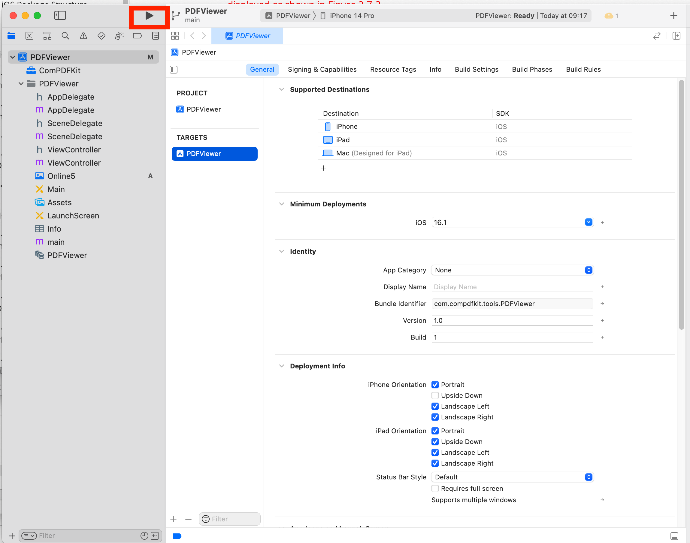
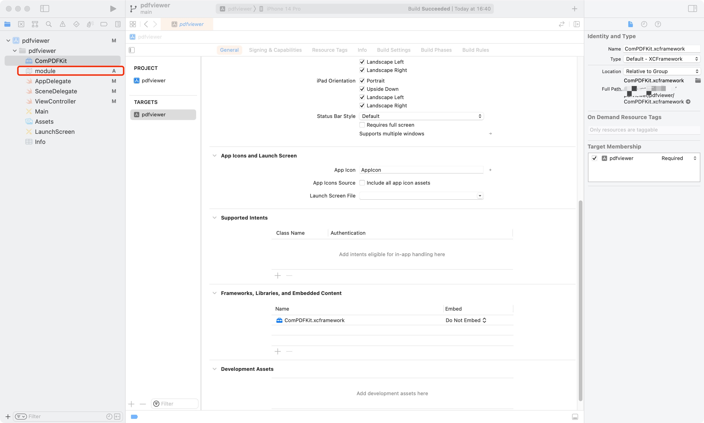
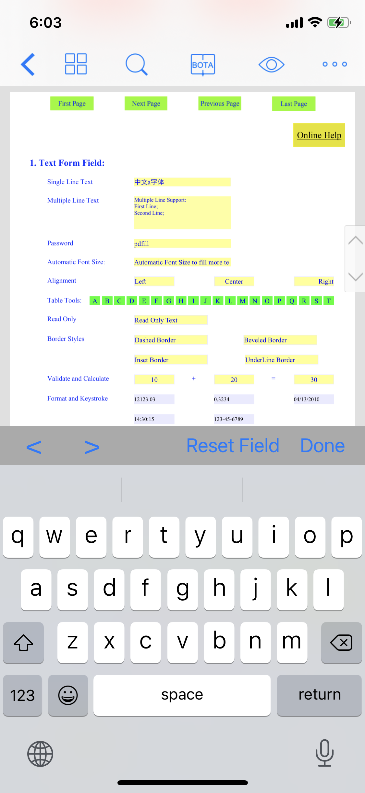
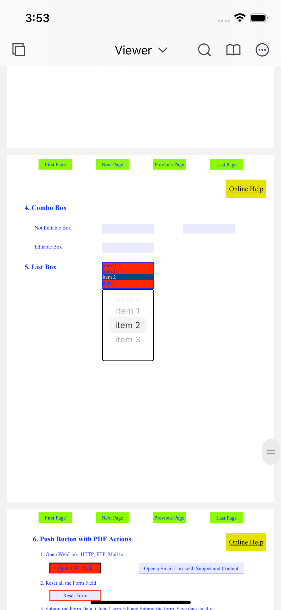
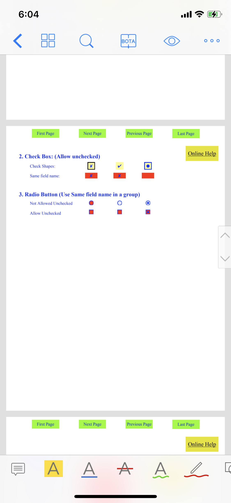

# 1 Overview

ComPDFKit PDF SDK for iOS is a robust PDF library for developers who need to develop applications on iOS, which offers powerful Objective-C APIs for quickly viewing, annotating, editing, and creating PDFs. It is feature-rich and battle-tested, making PDF files process and manipulation easier and faster for iOS devices.


## 1.1 ComPDFKit PDF SDK

ComPDFKit PDF SDK consists of two elements as shown in the following picture.


The two elements for ComPDFKit PDF SDK:

- **PDF Core API**

  The Core API can be used independently for document rendering, analysis, text extraction, text search, form filling, password security, annotation creation and manipulation, and much more.

- **PDF View**

  The PDF View is a utility class that provides the functionality for developers to interact with rendering PDF documents per their requirements. The View Control provides fast and high-quality rendering, zooming, scrolling, and page navigation features. The View Control is derived from platform-related viewer classes (e.g. `UIView` on iOS) and allows for extension to accommodate specific user needs.


## 1.2 Key Features

**Viewer** component offers:

- Standard page display modes, including Scrolling, Double Page, Crop Mode, and Cover Mode.
- Navigation with thumbnails, outlines, and bookmarks.
- Text search & selection.
- Zoom in and out & Fit-page.
- Switch between different themes, including Dark Mode, Sepia Mode, Reseda Mode, and Custom Color Mode.
- Text reflow.

**Annotations** component offers:

- Create, edit, and remove annotations, including Note, Link, Free Text, Line, Square, Circle, Highlight, Underline, Squiggly, Strikeout, Stamp, Ink, and Sound.
- Support for annotation appearances.
- Import and export annotations to/from XFDF.
- Support for annotation flattening.
- Predefine annotations.

**Forms** component offers:

- Create, edit and remove form fields, including Push Button, Check Box, Radio Button, Text Field, Combo Box, List Box, and Signature.
- Fill PDF Forms.
- Support for PDF form flattening.

**Document Editor** component offers:

- PDF manipulation, including Split pages, Extract pages, and Merge pages.
- Page edit, including Delete pages, Insert pages, Crop pages, Move pages, Rotate pages, Replace pages, and Exchange pages.
- Document information setting.
- Extract images.

**Content Editor** component offers:

- Programmatically add and remove text in PDFs and make it possible to edit PDFs like Word. Allow selecting text to copy, resize, change colors, text alignment, and the position of text boxes.
- Undo or redo any change.

**Security** component offers:

- Encrypt and decrypt PDFs, including Permission setting and Password protected.
- Create, edit, and remove watermark.
- Redact content including images, text, and vector graphics.
- Create, edit, and remove header & footer, including dates, page numbers, document name, author name, and chapter name.
- Create, edit, and remove bates numbers.
- Create, edit, and remove background that can be a solid color or an image.

**Conversion** component offers:

- PDF to PDF/A.


## 1.3 License

ComPDFKit PDF SDK is a commercial SDK, which requires a license to grant developer permission to release their apps. Each license is only valid for one bundle ID in development mode. Other flexible licensing options are also supported, please contact [our marketing team](mailto:support@compdf.com) to know more.  However, any documents, sample code, or source code distribution from the released package of ComPDFKit to any third party is prohibited.


# 2 Get Started

It is easy to embed ComPDFKit in your iOS app with a few lines of Objective-C code. Take just a few minutes and get started. 

The following sections introduce the structure of the installation package, how to run a demo, and how to make an iOS app in Objective-C with ComPDFKit PDF SDK. 


## 2.1 Requirements

ComPDFKit requires the latest stable version of Xcode available at the time the release was made. This is a hard requirement, as each version of Xcode is bundled with a specific version of the iOS Base SDK, which often defines how UIKit and various other frameworks behave. 

- iOS 10.0 or higher.
- Xcode 12.0 or newer for Objective-C or Swift.


## 2.2 iOS Package Structure

The package of ComPDFKit PDF SDK for iOS includes the following files:

- ***"Lib"*** - Include the ComPDFKit.xcframework dynamic library (arm64_armv7, x86_64-simulator) and associated header files.

- ***"Examples"*** - A folder containing iOS sample projects.
  - ***"Viewer"*** - A basic PDF viewer, including reading PDFs, changing themes, bookmarks, searching text, etc.
  
  - ***"Annotations"*** - A PDF viewer with full types of annotation editing, including adding annotations, modifying annotations,  annotation lists, etc.
  
  - ***"ContentEditor"*** - A PDF viewer with text and image editing, including modifying text, replacing images, etc.
  
  - ***"Forms"*** - A PDF viewer with full types of forms editing, including radio button, combo box, etc.
  
  - ***"DocsEditor"*** - A PDF viewer with page editing, including inserting/deleting pages, extracting pages, reordering pages, etc.
  
  - ***"PDFViewer"*** - A multi-functional PDF program that integrates all of the above features.
  
  - ***"ComPDFKit_Tools"*** - A default control library for quickly building various function modules of PDF viewer.
  
  - ***"PDFViewer-Swift"*** - A folder containing Swift iOS sample projects.
  
- ***"api_reference_ios"*** - API reference.

- ***"developer_guide_ios.pdf"*** - Developer guide.

- ***"release_notes.txt"*** - Release information.

- ***"legal.txt"*** - Legal and copyright information.

- ***"TestFile"*** - A folder containing test files.


## 2.3 How to Run a Demo

ComPDFKit PDF SDK for iOS provides multiple demos in Objective-C for developers to learn how to call the SDK on iOS. You can find them in the ***"Examples"*** folder.

In this guide, we take ***"PDFViewer"*** as an example to show how to run it in Xcode (The demo in Objective-C uses the ***"xcworkspace"*** method, so you can directly open ***"PDFViewer.xcworkspace"***).

1. Copy the applied ***"license_key_ios.xml"*** file to ***"Examples"*** folder to replace (There is already a method to parse the xml file in demo, please do not modify the storage location and file name).

2. Find ***"PDFViewer.xcworkspace"*** in the ***"Examples"*** folder and double-click to open it, find the schemes of ***"PDFViewer"*** in Xcode, and select the corresponding simulator (ComPDFKit does not support the simulator to run M1 chip, but we have made it compatible in `Excluded Architectures`, you can see the processing method in [2.4.5 Troubleshooting](#2.4.5 Troubleshooting)).

   

3. Click **Product -> Run** to run the demo on an iOS device. In this guide, we use an iPhone 14 device as an example. After building the demo successfully, the ***"PDF32000_2008.pdf"*** file will be opened and displayed.

   

**Note:** *This is a demo project, presenting completed ComPDFKit PDF SDK functions. The functions might be different based on the license you have purchased. Please check that the functions you choose work fine in this demo project.*


## 2.4 How to Make an iOS App in Objective-C with ComPDFKit

This section will help you to quickly get started with ComPDFKit PDF SDK to make an iOS app in Objective-C with step-by-step instructions, which include the following steps:

1. Create a new iOS project in Objective-C.
2. Integrate ComPDFKit into your apps.
3. Apply the license key.
4. Display a PDF document.


### 2.4.1 Create a New iOS Project in Objective-C

In this guide, we use Xcode 12.4 to create a new iOS project.

Fire up Xcode, choose **File** -> **New** -> **Project...**, and then select **iOS** -> **Single View Application**. Click **Next**.


Choose the options for your new project. Please make sure to choose Objective- C as the programming language. Then, click **Next**.


Place the project to the location as desired. Then, click **Create**.


### 2.4.2 Integrate ComPDFKit into Your Apps

There are two ways to integrate ComPDFKit PDF SDK for iOS into your apps. You can choose what works best for you based on your requirements.

If you just want to use the default built-in Ul implementations to develop your apps for simplicity and convenience, you need to include the following files:

- ***“ComPDFKit.xcframework：*** - Include the ComPDFKit dynamic library (arm64_armv7, x86_64-simulator) and associated header files.
- ***”Source files“*** - Found in the ***" PDFViewer / Source "*** folder. They are the default built-in Ul.
- ***"Resource files"*** - Found in the ***" PDFViewer / Resources "*** folder. They are needed for the default built-in Ul implementations, such as images, strings, and other resources.

If you want to customize your (PDF-related) app’s Ul design, you need to include the following files:

- ***"ComPDFKit.xcframework"*** - Include the ComPDFKit PDF SDK dynamic library (arm64_armv7, x86_64-simulator) and associated header files.
- ***"Resource files“*** - Found in the ***" PDFViewer / Resources "*** folder. They are needed for the default built-in Ul implementations, such as images, strings, and other resources.

To add the dynamic xcframework ***"ComPDFKit.xcframework"*** into the ***"PDFViewer"*** project, please follows the steps below:

1. Right-click the ***"PDFViewer"*** project, select **Add Files to "PDFViewer"...**.

   

   Find and choose ***"ComPDFKit.xcframework"*** in the download package, and then click **Add**.

   **Note:** *Make sure to check the **Copy items if needed** option.*

   

   Then, the ***"PDFViewer"*** project will look like the following picture.

   

3. Add the dynamic xcframework ***"ComPDFKit.xcframework"*** to the Xcode’s **Embedded Binaries**. Left-click the project, find **Embedded Binaries** in the **General** tab, and choose **Embed & Sign**.

   

   For earlier versions of Xcode (like Xcode 13), the Bitcode option might be turned on by default, which requires it to be turned off to run. The precise step to do this are illustrated as shown in the picture below. 
   
   


### 2.4.3 Apply the License Key

1. Import the header file ***"ComPDFKit/ComPDFKit.h"*** to `AppDelegate.m`.

2. Follow the code below and call the method `CPDFKit setLicenseKey:@"LICENSE_KEY" secret:@"LICENSE_SECRET"` in `- (BOOL)application:(UIApplication *)application didFinishLaunchingWithOptions:(NSDictionary *)launchOptions`. You need to replace the  **LICENSE_KEY** and **LICENSE_SECRET** with the license you obtained.

   ```objective-c
   #import <ComPDFKit/ComPDFKit.h>
   
   - (BOOL)application:(UIApplication *)application didFinishLaunchingWithOptions:(NSDictionary *)launchOptions {
     // Set your license key here. ComPDFKit is commercial software.
     // Each ComPDFKit license is bound to a specific app bundle id.
     // com.compdfkit.pdfviewer
       
       [CPDFKit setLicenseKey:@"YOUR_LICENSE_KEY_GOES_HERE"
                       secret:@"YOUR_LICENSE_SECRET_GOES_HERE"];
       
       return YES;
   }
   ```

Compile and run the project. If the console outputs "version information", it means that the license has been set successfully. Otherwise, please check the "Troubleshooting" section at [2.4.5](#2.4.5 Troubleshooting) or check error logs in the console to quickly identify and solve the issue. 


### 2.4.4 Display a PDF Document

So far, we have added ***"ComPDFKit.xcframework"*** to the ***"PDFViewer"*** project, and finished the initialization of the ComPDFKit PDF SDK. Now, let’s start building a simple PDF viewer with just a few lines of code.

1. Prepare a test PDF file, drag and drop it into the newly created **PDFView** project. By this way, you can load and preview the local PDF document using `NSBundle`. The following image shows an example of importing a PDF document named “Online5” into the project.

   

2. Import `<ComPDFKit/ComPDFKit.h>`  at the top of your `UIViewController.m` subclass implementation:

   ```objective-c
   #import <ComPDFKit/ComPDFKit.h>
   ```

3. Create a `CPDFDocument` object through **NSURL**, and create a `CPDFView` to display it. The following code shows how to load PDF data using a local PDF path and display it by `CPDFView`.

   ```objective-c
   NSBundle *bundle  = [NSBundle mainBundle];
   NSString *pdfPath= [bundle pathForResource:@"Online5" ofType:@"pdf"];
   NSURL *url = [NSURL fileURLWithPath:pdfPath];
   CPDFDocument *document = [[CPDFDocument alloc] initWithURL:url];
   
   CGRect rect = self.view.bounds;
   CPDFView *pdfView = [[CPDFView alloc] initWithFrame:rect];
   pdfView.autoresizingMask = UIViewAutoresizingFlexibleWidth | UIViewAutoresizingFlexibleHeight;
   pdfView.document = document;
   ```

4. Add the created `CPDFView` to the view of the current controller. The sample code shows below.

   ```objective-c
    [self.view addSubview:pdfView];
   ```

   The code shown here is a collection of the steps mentioned above:

   ```objective-c
   - (void)viewWillAppear:(BOOL)animated {
       [super viewWillAppear:animated];
       
       NSBundle *bundle  = [NSBundle mainBundle];
       NSString *pdfPath= [bundle pathForResource:@"Online5" ofType:@"pdf"];
       NSURL *url = [NSURL fileURLWithPath:pdfPath];
       CPDFDocument *document = [[CPDFDocument alloc] initWithURL:url];
   
       CGRect rect = self.view.bounds;
       CPDFView *pdfView = [[CPDFView alloc] initWithFrame:rect];
       pdfView.autoresizingMask = UIViewAutoresizingFlexibleWidth | UIViewAutoresizingFlexibleHeight;
       pdfView.document = document;
       [self.view addSubview:pdfView];
   }
   ```

5. Connect your device or simulator, and use shortcut **Command_R** to run the App. The PDF file will be opened and displayed.

   


### 2.4.5 Troubleshooting

1. Bitcode

   Even when all configurations are correct, there may still be compilation errors. First, check if bitcode is disabled. In earlier versions of Xcode (such as Xcode 13), the Bitcode option may be enabled by default. It needs to be set to **No** in order to run the app.

2. License

   If a License setting error occurs, ensure that the Identity (Bundle ID) setting in **General** matches the Bundle ID you provided when contacting us for the license. If an expired License message appears, please contact the [ComPDFKit team](https://www.compdf.com/contact-us) to obtain the latest License and Key.


3. Mac with M1 Chip Cannot Run Projects on Simulator

   Currently, ***"ComPDFKit.xcframework"*** does not provide M-series simulator architecture, so you need to search for **Excluded Architectures** in **Build Settings** in **TARGETS**, and then double-click it. A pop-up box will be popped up, click the plus sign (as shown below) to add **arm64**.

   

4. No PDF Displayed

   Check if the special encoding is required in the path we passed in, or if the local path we passed in exists.


5. Other Problems

   If you meet some other problems when integrating our ComPDFKit PDF SDK for iOS, feel free to contact [ComPDFKit team](https://www.compdf.com/contact-us).


## 2.5 ARC Compatibility

ComPDFKit PDF SDK requires [non-ARC](https://www.codeography.com/2011/10/10/making-arc-and-non-arc-play-nice.html). If you wish to use ComPDFKit PDF SDK in a ARC project, just add the -fno-objc-arc compiler flag. To do this, go to the Build Phases tab in your target settings, open the Compile Sources group, and double-click and type [-fno-objc-arc](https://www.jianshu.com/p/b8cccbbd03f3) into the popover.


## 2.6 Swift Compatibility

To use the ComPDFKit Objective-C Framework in your Swift project, you have to create a Swift Bridging Header file in that project. The best way is to create the .h file manually.

1. The First Method

   First, add a header file to your project with the name: MyProjectName-Bridging-Header.h. This will be the single header file where you import any Objective-C code **that** you need your Swift code to access.

   Then, find Swift Compiler - Code Generation section in your project build settings. Add the path to your bridging header file next to Objective-C Bridging Header from the project root folder. It should be MyProject/MyProject-Bridging-Header.h.

2. The Second Method:

   Import modules. Find the ***"ComPDFKit.xcframework"*** folder -> ***"ios-arm64_armv7"*** -> ***"ComPDFKit.framework"*** -> ***"Modules"***. Then, import the ***"Modules"*** folder entirely or just import the ***"Module“*** files within the ***”Modules“*** folder. See the picture below for the details.

   

   The subsequent operations can be configured in the same way as the configuration method of Objective-C.


# 3 Guides

If you’re interested in all of the features mentioned in Overview section, please go through our guides to quickly add PDF viewing, annotating, and editing to your application. The following sections list some examples to show you how to add document functionalities to iOS apps using our Swift and Objective-C APIs.


## 3.1 Basic Operations

There are a few commonly used basic operations when working with documents.


### 3.1.1 Open a Document

- Open a Local File

  ```objective-c
  // Get the path of a PDF
  NSString *pdfPath = @"...";
  
  // Initialize a CPDFDocument object with the path to the PDF file
  NSURL *url = [NSURL fileURLWithPath:pdfPath];
  CPDFDocument *document = [[CPDFDocument alloc] initWithURL:url];
  if (document.error && document.error.code != CPDFDocumentPasswordError) {
      return;
  }
  ```

- Create a New File

  ```objective-c
  CPDFDocument *document = [[CPDFDocument alloc] init];
  ```


Following are the descriptions of error codes in `CPDFDocumentErrorDomain`:


| Error              | Description                                           |
| ------------------------- | ------------------------------------------------------------ |
| CPDFDocumentUnknownError  | Unknown error.                                               |
| CPDFDocumentFileError     | File not found or could not be opened.                       |
| CPDFDocumentFormatError   | File not in PDF format or corrupted.                         |
| CPDFDocumentPasswordError | Password required or incorrect password.                     |
| CPDFDocumentSecurityError | Security scheme not supported. |
| CPDFDocumentPageError     | Page not found or content error.                             |

**Note:** *This is a time-consuming process, so it needs to be executed in a sub-thread. After the document is successfully opened, the UI that renders the PDF is initialized.*


### 3.1.2 Save a Document

To save a PDF document to path use `CPDFDocument::writeToURL:`.

If this path is the original path, the PDF document will be saved incrementally. Use the incremental mode if you are concerned about saving time. If you use this mode, any changes to the document, even deleting annotations, will result in appending to the PDF file.

Incremental saving, which is enabled by default, is the strategy that ComPDFKit uses to ensure saving is as fast as possible. This strategy always appends changes to the end of the document, and it never deletes anything.  However, even though this is the fastest way to save a document, it does come with the cost of increasing the file size with each save. You can read more about incremental saving and full saving of PDFs here.

In most cases, the increase in file size is negligible. However, in some cases, you may want to prioritize file size over saving performance. Below you'll find some strategies to prevent file size from growing unnecessarily when saving changes to a document.

If the document is saved in a new path (Not the original storage path), there is going to trigger a non-incremental document save, which will rewrite the entire document instead of appending changes at the end.


## 3.2 Viewer


`CPDFView` scroll view is a scroll view component that can load and display PDF pages on screen on demand. It can handle various rendering and scaling operations of PDF pages, and maintain the clarity and sharpness of PDF pages. `CPDFView` scroll view usually supports multiple different layout modes, such as vertical scrolling, single page scrolling, and more. These layout modes can be configured according to users' needs to suit different application scenarios. When using `CPDFView` scroll view to view PDFs, users can also easily implement various functions such as zooming in and out, rotating, flipping, dragging, adding bookmarks, etc. It provides a simple way for developers to quickly embed a highly configurable PDF viewer into any Windows application.


### 3.2.1 Display Modes

- Scroll Direction

  When scrolling through pages of a document in `CPDFView`, the scrolling direction can be changed by setting the page display direction.

  - Vertical scrolling mode (also known as continuous mode) can be enabled by setting the page display direction to `CPDFDisplayDirectionVertical`.

    ```objective-c
    pdfView.displayDirection = CPDFDisplayDirectionVertical;
    ```

  - Horizontal scrolling mode (also known as non-continuous mode) can be enabled by setting the page display direction to `CPDFDisplayDirectionHorizontal`.

    ```objective-c
    pdfView.displayDirection = CPDFDisplayDirectionHorizontal;
    ```

  You also can configure the scroll direction of `CPDFView` in `CPDFKitConfig`.

  ```objective-c
  CPDFKitShareConfig.displayDirection = CPDFDisplayDirectionVertical;
  ```

- Double Page

  Display two pages side-by-side.
  
  ```objective-c
  pdfView.displayTwoUp = YES;
  ```
  
- Cover Mode

  Show cover page during double page.

  ```objective-c
  pdfView.displayTwoUp = YES;
  pdfView.displaysAsBook = YES;
  ```
  
- Crop Mode

  Automatically trim PDF files white margins to resize pages. Crop mode can be enabled by setting the page display crop to `Yes`.

  ```objective-c
  pdfView.displayCrop = YES;
  ```

**Note:** *You must call `layoutDocumentView` method explicitly if using these `CPDFView` properties (`displayDirection`, `displaysPageBreaks`, `pageBreakMargins`, `displayTwoUp`, `displaysAsBook`, `displayCrop`).*


### 3.2.2 PDF Navigation

- Page Navigation

  After loading a PDF document, you can programmatically interact with it, which allows you to scroll to different pages or destinations. All of the interaction APIs are available on `CPDFView`.

  - To scroll to the specified page, use the function `CPDFView::goToPageIndex:animated:`.

  - To go to the specified destination including a page and a point on the page specified in page space, use the function `CPDFView::goToDestination:animated:`.

  - To go to the specified rectangle on the specified page, use the function `CPDFView::goToRect:onPage:animated:`.

    This allows you to scroll the `CPDFView` object to a specific `CPDFAnnotation` or `CPDFSelection` object, because both of these objects have bounds methods that return an annotation or selection position in page space.
    
    **Note:** *This method’s rect is specified in page-space coordinates. Page space is a coordinate system with the origin at the lower-left corner of the current page.*

- Outlines

  PDF outline is a function that creates a directory structure in PDF documents, which allows users to browse, locate, and navigate to the parts of a document they are interested in more quickly and conveniently. The outline can be created by nesting, organizing the document content by elements such as headings, chapters, paragraphs, etc., and adding hyperlinks to each element for easily jumping to the corresponding position. PDF outline is very useful when reading long documents, saving users' time and improving reading efficiency.

  The outline structure is a tree-like hierarchy, so the function `CPDFDocument::outlineRoot` must be called first to get the root node of the entire outline before accessing the outline. Here, the “root node” is an abstract object which can only have some child outlines without the next sibling outline and any data (including outline data, destination data, and operation data). It cannot be displayed on the application UI since it has no data. If there is no root node, a new one can be created with the function `CPDFDocument::setNewOutlineRoot`.

  After the root outline is retrieved, the following functions can be called to access other outlines:

    - To access the parent outline, use the function `CPDFOutline::parent`.


```objective-c
- To access the child outline.

  - (NSArray<CPDFOutline *> *)childOutline:(CPDFOutline *)outline {
      NSUInteger numberOfChildren = [outline numberOfChildren];
    	NSMutableArray *child = [NSMutableArray array];
    	for (int i=0; i<numberOfChildren; i++) {
  				[child addObject:[outline childAtIndex:i]];
  		}
      return child;
  }

```


    - To insert a new outline, use the function `CPDFOutline::insertChildAtIndex:`.


    - To remove an outline, use the function `CPDFOutline::removeFromParent`.


    - To move an outline, use the function `CPDFOutline::insertChild:atIndex:`. When moving items around within an outline hierarchy, you should retain the item and call `CPDFOutline::removeFromParent` first.


- Bookmarks

  Since each bookmark is associated with a specific page, it provides the ability to link to a different page in a document allowing the user to navigate interactively from one part of the document to another.

  - To access bookmarks, use the function `CPDFDocument::bookmarks`.
  - To access a bookmark for a page, use the function `CPDFDocument::bookmarkForPageIndex:`.
  - To add a new bookmark, use the function `CPDFDocument::addBookmark:forPageIndex:`.
  - To remove a bookmark, use the function `CPDFDocument::removeBookmarkForPageIndex:`.

**Note: ** *Adding and removing bookmarks will result in corresponding UI changes on the corresponding `CPDFView`, which requires to call `setNeedsDisplayForPage:` to refresh.*


### 3.2.3 Text Search & Selection

- Text Search

  ComPDFKit PDF SDK offers developers an API for programmatic full-text search, as well as UI for searching and highlighting relevant matches.
  
  There are some optional parameters provided when searching, such as ignoring case, matching whole words, and other Options parameter settings (It is case-insensitive and does not match whole words by default).
  
  ```objective-c
  typedef NS_OPTIONS(NSInteger, CPDFSearchOptions) {
      CPDFSearchCaseInsensitive = 0,
      /** If not set, it will not match case by default. */
      CPDFSearchCaseSensitive = 1,
      /** If not set, it will not match the whole word by default. */
      CPDFSearchMatchWholeWord = 2,
      /** If not set, it will skip past the current match to look for the next match. */
      CPDFSearchConsecutive = 4
  };
  ```
  
    - To asynchronously find all instances of the specified string in the document, use function `CPDFDocument::beginFindString:withOptions:`, which returns immediately. It causes delegate methods to be called when searching begins and ends, on each search hit, and when the search proceeds to a new page.
  
      ```objective-c
      /**
       * Called when the beginFindString:withOptions: or findString:withOptions: method begins finding.
       */
      - (void)documentDidBeginDocumentFind:(CPDFDocument *)document;
      /**
       * Called when the beginFindString:withOptions: or findString:withOptions: method returns.
       */
      - (void)documentDidEndDocumentFind:(CPDFDocument *)document;
      /**
       * Called when a find operation begins working on a new page of a document.
       */
      - (void)documentDidBeginPageFind:(CPDFDocument *)document pageAtIndex:(NSUInteger)index;
      /**
       * Called when a find operation finishes working on a page in a document.
       */
      - (void)documentDidEndPageFind:(CPDFDocument *)document pageAtIndex:(NSUInteger)index;
      /**
       * Called when a string match is found in a document.
       *
       * @discussion To determine the string selection found, use the selection.
       */
      - (void)documentDidFindMatch:(CPDFSelection *)selection;
      ```
  
  
    - To asynchronous find all instances of the specified string in the document, use the function `CPDFDocument::findString:withOptions:`. Each hit gets added to an `NSArray` object as a `CPDFSelection` object. If there are no hits, this method returns an empty array. Use this method when the complete search process will be brief and when you don’t need the flexibility or control offered by `CPDFDocument::beginFindString:withOptions:`.
  
  
    - To cancel a search initiated with `CPDFDocument::beginFindString:withOptions:`, use the function `CPDFDocument::cancelFindString`.
  
  
    - To highlight search result, `CPDFView` offers a way to both add and clear search results, use the function `CPDFView::setHighlightedSelection:animated:`.
  
- Text Selection

  PDF text contents are stored in `CPDFPage` objects which are related to a specific page. `CPDFPage` class can be used to retrieve information about text in a PDF page, such as single character, single word, text content within specified character range or bounds and more.

  How to get the text bounds on a page by selection:

  ```objective-c
  - (CPDFSelection *)selectionForPage:(CPDFPage *)page fromPoint:(CGPoint)fPoint toPoint:(CGPoint)tPoint {
  		NSInteger fCharacterIndex = [page characterIndexAtPoint:fPoint];
  		NSInteger tCharacterIndex = [page characterIndexAtPoint:tPoint];
    	NSRange range = NSMakeRange(fCharacterIndex, tCharacterIndex - fCharacterIndex + 1);
    	CPDFSelection *selection = [page selectionForRange:range];
    	return selection;
  } 
  ```


### 3.2.4 Zooming

ComPDFKit PDF SDK provides super zoom out and in to unlock more zoom levels, and pinch-to-zoom or double tap on the specific area to perform a smart page content analysis, or you can programmatically interact with it by using the following method.

- Manual Zooming

  You can use `CPDFView::setScaleFactor:animated:` to zoom the current document.

- Disabling Zooming

  Zooming can be disabled by setting the `scrollEnabled` to `NO` on `CPDFView`.

  ```objective-c
  pdfView.scrollEnabled = NO;
  ```


### 3.2.5 Themes


Theme color refers to rendering pages in the PDF document with a certain background color to enhance the visual effect when reading. For example, set the PDF document background to a solid background.

`CPDFView` has four special color modes: dark mode, sepia mode, reseda mode, and custom color mode. 

In dark mode, colors are adjusted to improve reading at night or in a poorly-lit environment, in sepia mode, background color is set to emulate the look of an old book, in reseda mode, light-green background is displayed to protect your eyes after long-time reading, and in custom color mode, you can set a custom color for the background color.

**Note:** *Changing the appearance mode will change the PDF rendering style, but it does not modify the PDF on disk.*

To set the color mode:

1. Find the constant value of the color mode

   | Themes            | Constant value          |
   | ----------------- | ----------------------- |
   | Normal color mode | `CPDFDisplayModeNormal` |
   | Dark mode         | `CPDFDisplayModeNight`  |
   | Sepia mode        | `CPDFDisplayModeSoft`   |
   | Reseda mode       | `CPDFDisplayModeGreen`  |
   | Custom color mode | `CPDFDisplayModeCustom` |

2. Call `CPDFView::setDisplayMode:`.

3. If you are using `CPDFDisplayModeCustom`, call `CPDFView::setDisplayModeCustomColor:` to set the background color.

4. Update `CPDFView` to redraw the contents.

   ```objective-c
   [pdfView layoutDocumentView];
   ```

You also can configure the color mode of `CPDFView` in `CPDFKitConfig`.

```objective-c
CPDFKitShareConfig.displayMode = CPDFDisplayModeCustom;
CPDFKitShareConfig.displayModeCustomColor = [UIColor whiteColor];
```


### 3.2.6 Text Reflow

Rearrange text to fit the device screen size for displaying the same layout by using the following method.

```objective-c
NSURL *url = [NSURL fileURLWithPath:pdfPath];
CPDFDocument *document = [[CPDFDocument alloc] initWithURL:url];
CPDFPage *page = [document pageAtIndex:0];

NSRange range = NSMakeRange(0, page.numberOfCharacters);
NSString *string = [page stringForRange:range];
```


### 3.2.7 Rendering

The `CPDFView` class calls `drawPage:toContext:` as necessary for each visible page that requires rendering. You can override this method to draw on top of a PDF page. In this case, invoke this method on `super` and then perform custom drawing on top of the PDF page. Do not invoke this method, except by invoking it on `super` from a subclass.


### 3.2.8 Custom Menu

When viewing a PDF, after selecting text and long-pressing on a blank area, the PDF context will enter the corresponding interaction state. A context menu like `UIMenuController` will be popped up in different interaction states, and you can perform related operations through the context menu options.


The following are examples of the additional context menus when selecting text and long-pressing on a blank area:

```objective-c
- (NSArray<UIMenuItem *> *)menuItemsAtPoint:(CGPoint)point forPage:(CPDFPage *)page {
    NSArray *items = [super menuItemsAtPoint:point forPage:page];
    
    NSMutableArray *menuItems = [NSMutableArray arrayWithArray:items];
    if (self.currentSelection) {
        UIMenuItem *textNoteItem = [[UIMenuItem alloc] initWithTitle:NSLocalizedString(@"Note", nil)
                                                              action:@selector(textNoteItemAction:)];
        UIMenuItem *textShareItem = [[UIMenuItem alloc] initWithTitle:NSLocalizedString(@"Share", nil)
                                                               action:@selector(textShareItemAction:)];
        UIMenuItem *defineItem = [[UIMenuItem alloc] initWithTitle:NSLocalizedString(@"Define", nil)
                                                            action:@selector(defineItemAction:)];
        UIMenuItem *linkItem = [[UIMenuItem alloc] initWithTitle:NSLocalizedString(@"Link", nil)
                                                          action:@selector(linkItemAction:)];
        UIMenuItem *searchItem = [[UIMenuItem alloc] initWithTitle:NSLocalizedString(@"Search", nil)
                                                            action:@selector(searchItemAction:)];
        [menuItems insertObject:textNoteItem atIndex:0];
        [menuItems addObject:textShareItem];
        [menuItems addObject:defineItem];
        [menuItems addObject:linkItem];
        [menuItems addObject:searchItem];
    } else {
        UIMenuItem *textNoteItem = [[UIMenuItem alloc] initWithTitle:NSLocalizedString(@"Note", nil)
                                                              action:@selector(textNoteItemAction:)];
        UIMenuItem *textItem = [[UIMenuItem alloc] initWithTitle:NSLocalizedString(@"Text", nil)
                                                          action:@selector(textItemAction:)];
        UIMenuItem *pasteItem = [[UIMenuItem alloc] initWithTitle:NSLocalizedString(@"Paste", nil)
                                                           action:@selector(pasteItemAction:)];
        [menuItems addObject:textNoteItem];
        [menuItems addObject:textItem];
        
        NSString *textType = (NSString *)kUTTypeText;
        NSString *urlType  = (NSString*)kUTTypeURL;
        NSString *urlFileType  = (NSString*)kUTTypeFileURL;
        NSString *jpegImageType = (NSString *)kUTTypeJPEG;
        NSString *pngImageType = (NSString *)kUTTypePNG;
        NSString *rawImageType = @"com.apple.uikit.image";
        BOOL isPasteboardValid = [[UIPasteboard generalPasteboard] containsPasteboardTypes:[NSArray arrayWithObjects:textType, urlType, urlFileType, jpegImageType, pngImageType, rawImageType, nil]];
        if (isPasteboardValid) {
            [menuItems addObject:pasteItem];
        }
    }
    return menuItems;
}
```


### 3.2.9 Highlight of Form Fields and Hyperlinks


The highlight feature of PDF form fields can help users quickly locate and fill out forms, which greatly improves work efficiency in scenarios where a large number of forms need to be filled out.  At the same time, the highlight feature of hyperlink annotations allows users to add hyperlinks and annotations to important information in PDF documents, making it more convenient for other users to quickly find and understand the information, and also improving the readability and interactivity of PDF documents. these features make it easier and more efficient for users to use PDF documents for work and study. These features enable users to use PDF documents more conveniently and efficiently for work and study.

- Use `[[CPDFKitConfig sharedInstance] setEnableFormFieldHighlight:]` to set whether to highlight form fields.

- Use `[[CPDFKitConfig sharedInstance] setEnableLinkFieldHighlight:]` to set whether to highlight hyperlinks.


### 3.2.10 Get the Selected Text

ComPDFKit PDF SDK provides the API to get the currently selected text `CPDFView::currentSelection` from the `CPDFView`. Select text in `CPDFView` and get the corresponding `CPDFSelection`, then you can get the corresponding text in `CPDFSelection::string`. The code below shows how to get the selected text in `CPDFView`.

```objective-c
CPDFSelection *currentSelection = pdfView.currentSelection;
NSString *currentText = [currentSelection string]
```


## 3.3 Annotations

PDF annotations refer to adding, editing, and sharing various multimedia contents on PDF documents, such as note, link, free text, shapes, markup, stamps, ink, sound, etc. By adding annotations, users can more conveniently mark, annotate, revise, comment, sign, and share PDF documents. 

PDF annotations are very useful for document communication, review, and revision, and can improve work efficiency and document quality. At the same time, ComPDFKit PDF SDK provides different annotation features and tools, and developers can choose suitable features and tools according to their needs.


### 3.3.1 Annotation Types

ComPDFKit PDF SDK supports all common annotation types:


| **Type**                                              | **Description**                                              | Class                                                        |
| ----------------------------------------------------- | ------------------------------------------------------------ | ------------------------------------------------------------ |
| Note                                                  | Add notes to PDF documents to mark important text, tables, images, and more, making it convenient for you and other readers to read and understand. | `CPDFTextAnnotation`                                         |
| Link                                                  | Add hyperlinks to PDF documents to link to web pages, emails, or specific locations in other documents. | `CPDFLinkAnnotation`                                         |
| Free Text                                             | Add text and comments to PDF documents.                      | `CPDFFreeTextAnnotation`                                     |
| Shapes: Square, Circle, and Line                      | Add graphic elements like shapes, lines, arrows, or images to PDF documents to emphasize or illustrate certain content. | `CPDFSquareAnnotation`<br />`CPDFCircleAnnotation`<br />`CPDFLineAnnotation` |
|                                                       |                                                              |                                                              |
| Markup: Highlight, Underline, Strikeout, and Squiggly | Add markups to PDF documents to highlight, emphasize, or illustrate specific content, such as important paragraphs, lines or words, keywords or tables, etc. | `CPDFMarkupAnnotation`                                       |
| Stamp                                                 | Add stamps to PDF documents to identify and verify the source and authenticity of documents, using the formats of numbers or images to represent signers. | `CPDFStampAnnotation`                                        |
| Ink                                                   | Draw the brush trails freely anywhere in PDF documents, making it easy for users to add doodles, charts, sketches, signatures, or other custom content. | `CPDFInkAnnotation`                                          |
| Sound                                                 | Add sound and other multimedia content to PDF documents to enrich the presentation. | `CPDFSoundAnnotation`                                        |

ComPDFKit PDF SDK supports most annotation types defined in PDF Reference and provides APIs for annotation creation, properties access and modification, appearance setting, and drawing. These standard annotations can be read and written by many apps, such as Adobe Acrobat and Apple Preview.


### 3.3.2 Access Annotations


`CPDFAnnotation` is the base class for all annotations. It has no practical use and cannot instantiate objects,  only subclasses such as `CPDFCircleAnnotation` and `CPDFTextAnnotation` are useful. Any unknown or unsupported annotations will be filtered out when parsing a PDF.

To access the list of annotations by using the following method:

```objective-c
- (NSArray<CPDFAnnotation *>)annotationsWithDocument:(CPDFDocument *)document {
  	NSMutableArray *annotations = [NSMutableArray array];
  	for (int i=0; i<document.pageCount; i++) {
      	CPDFPage *page = [document pageAtIndex:i];
      	[annotations addObjectsFromArray:[page annotations]];
		}
}
```

The elements of the array will most likely be typed to subclasses of the `CPDFAnnotation` class.


### 3.3.3 Create & Edit Annotations

ComPDFKit PDF SDK includes a wide variety of standard annotations, and each of them is added to the project in a similar way.

- Note

  Add a sticky note (text annotation) to a PDF Document page by using the following method.

  ```objective-c
  NSURL *url = [NSURL fileURLWithPath:pdfPath];
  CPDFDocument *document = [[CPDFDocument alloc] initWithURL:url];
  CPDFPage *page = [document pageAtIndex:0];
  
  CPDFTextAnnotation *text = [[CPDFTextAnnotation alloc] initWithDocument:document];
  text.contents = @"test";
  text.bounds = CGRectMake(0, 0, 50, 50);
  text.color = [UIColor yellowColor];
  [page addAnnotation:text];
  ```

- Link

  Add a hyperlink or intra-document link annotation to a PDF Document page by using the following method.

  ```objective-c
  NSURL *url = [NSURL fileURLWithPath:pdfPath];
  CPDFDocument *document = [[CPDFDocument alloc] initWithURL:url];
  CPDFPage *page = [document pageAtIndex:0];
  
  CPDFDestination *dest = [[CPDFDestination alloc] initWithDocument:document pageIndex:1];
  CPDFLinkAnnotation *link = [[CPDFLinkAnnotation alloc] initWithDocument:document];
  link.bounds = CGRectMake(0, 0, 50, 50);
  link.destination = dest;
  //link.URL = @"https://www.";
  [page addAnnotation:link];
  ```

- Free Text

  Add a free text annotation to a PDF Document page by using the following method.

  ```objective-c
  NSURL *url = [NSURL fileURLWithPath:pdfPath];
  CPDFDocument *document = [[CPDFDocument alloc] initWithURL:url];
  CPDFPage *page = [document pageAtIndex:0];
  
  CPDFFreeTextAnnotation *freeText = [[CPDFFreeTextAnnotation alloc] initWithDocument:document];
  freeText.contents = @"test";
  freeText.bounds = CGRectMake(0, 0, 50, 50);
  freeText.font = [UIFont systemFontOfSize:12];
  freeText.fontColor = [UIColor redColor];
  freeText.alignment = NSTextAlignmentLeft;
  [page addAnnotation:freeText];
  ```
  
  For the created text annotations, ComPDFKit provides an API to begin and end the editing state of text annotation.
  
  ```objective-c
  - (void)editAnnotationFreeText:(CPDFFreeTextAnnotation *)freeText;
  - (void)commitEditAnnotationFreeText;
  ```
  
  For the text annotations being edited, ComPDFKit also provides an API to modify the font and font color properties. These do not need to end the editing state of text annotation,  and you can directly modify the properties in the editing process to change the annotation properties.
  
  ```objective-c
  - (void)setEditAnnotationFreeTextFont:(UIFont *)font;
  - (void)setEditAnnotationFreeTextColor:(UIColor *)color;
  ```

- Shapes

  Add a shape annotation to a PDF Document page by using the following method.

  ```objective-c
  NSURL *url = [NSURL fileURLWithPath:pdfPath];
  CPDFDocument *document = [[CPDFDocument alloc] initWithURL:url];
  CPDFPage *page = [document pageAtIndex:0];
  
  CPDFBorder *border = [[CPDFBorder alloc] initWithStyle:CPDFBorderStyleDashed
                                                  lineWidth:1
                                                dashPattern:@[@(2), @(1)]];
  
  // Square
  CPDFSquareAnnotation *square = [[CPDFSquareAnnotation alloc] initWithDocument:document];
  square.bounds = CGRectMake(0, 0, 50, 50);
  square.color = [UIColor redColor];
  square.interiorColor = [UIColor yellowColor];
  square.opacity = 0.5;
  square.interiorOpacity = 0.5;
  square.border = border;
  [page addAnnotation:square];
  
  // Circle
  CPDFCircleAnnotation *circle = [[CPDFCircleAnnotation alloc] initWithDocument:document];
  circle.bounds = CGRectMake(0, 0, 50, 50);
  circle.color = [UIColor redColor];
  circle.interiorColor = [UIColor yellowColor];
  circle.opacity = 0.5;
  circle.interiorOpacity = 0.5;
  circle.border = border;
  [page addAnnotation:circle];
  
  // Line
  CPDFLineAnnotation *line = [[CPDFLineAnnotation alloc] initWithDocument:document];
  line.startPoint = CGPointMake(0, 0);
  line.endPoint = CGPointMake(50, 50);
  line.startLineStyle = CPDFLineStyleNone;
  line.endLineStyle = CPDFLineStyleClosedArrow;
  line.color = [UIColor redColor];
  line.interiorColor = [UIColor yellowColor];
  line.opacity = 0.5;
  line.interiorOpacity = 0.5;
  line.border = border;
  [page addAnnotation:line];
  ```
  **Note:** *`CPDFLineAnnotation` properties (`startPoint`, `endPoint`) point is specified in page-space coordinates. Page space is a coordinate system with the origin at the lower-left corner of the current page.*

  *For each line, users can choose separate styles for the start and the end.  The styles are defined by the `CPDFLineStyle` enumeration.*

  | **Name**                 | **Description**                                              |
  | ------------------------ | ------------------------------------------------------------ |
  | CPDFLineStyleNone        | No special line ending.                                      |
  | CPDFLineStyleOpenArrow   | Two short lines meeting in an acute angle to form an open arrowhead. |
  | CPDFLineStyleClosedArrow | Two short lines meeting in an acute angle as in the LINETYPE_ARROW style and connected by a third line to form a triangular closed arrowhead filled with the annotation's interior color. |
  | CPDFLineStyleSquare      | A square filled with the annotation's interior color.        |
  | CPDFLineStyleCircle      | A circle filled with the annotation's interior color.        |
  | CPDFLineStyleDiamond     | A diamond shape filled with the annotation's interior color. |


- Markup

  Add a highlight annotation to a PDF Document page by using the following method, and add other markup annotations in a similar way.

  ```objective-c
  NSURL *url = [NSURL fileURLWithPath:pdfPath];
  CPDFDocument *document = [[CPDFDocument alloc] initWithURL:url];
  CPDFPage *page = [document pageAtIndex:0];
  
  CPDFSelection *selection = ...;
  NSMutableArray *quadrilateralPoints = [NSMutableArray array];
  for (CPDFSelection *selection in selection.selectionsByLine) {
      CGRect bounds = selection.bounds;
      [quadrilateralPoints addObject:[NSValue valueWithCGPoint:CGPointMake(CGRectGetMinX(bounds), CGRectGetMaxY(bounds))]];
      [quadrilateralPoints addObject:[NSValue valueWithCGPoint:CGPointMake(CGRectGetMaxX(bounds), CGRectGetMaxY(bounds))]];
      [quadrilateralPoints addObject:[NSValue valueWithCGPoint:CGPointMake(CGRectGetMinX(bounds), CGRectGetMinY(bounds))]];
      [quadrilateralPoints addObject:[NSValue valueWithCGPoint:CGPointMake(CGRectGetMaxX(bounds), CGRectGetMinY(bounds))]];
  }
  
  CPDFMarkupAnnotation *highlight = [[CPDFMarkupAnnotation alloc] initWithDocument:document markupType:CPDFMarkupTypeHighlight];
  highlight.color = [UIColor yellowColor];
  highlight.quadrilateralPoints = quadrilateralPoints;
  [page addAnnotation:highlight];
  ```

  **Note:** *Many annotation types are defined as markup annotations because they are used primarily to mark up PDF documents. Markup annotations may be divided into the following: highlight, underline, strikeout, and squiggly.*

- Stamp

  Add standard, text, and image stamps to a PDF document page by using the following method.

  ```objective-c
  NSURL *url = [NSURL fileURLWithPath:pdfPath];
  CPDFDocument *document = [[CPDFDocument alloc] initWithURL:url];
  CPDFPage *page = [document pageAtIndex:0];
  
  // Standard
  CPDFStampAnnotation *standard = [[CPDFStampAnnotation alloc] initWithDocument:document type:0];
  [page addAnnotation:standard];
  
  // Text
  CPDFStampAnnotation *text = [[CPDFStampAnnotation alloc] initWithDocument:document text:@"test" detailText:@"detail text" style:CPDFStampStyleRed shape:CPDFStampShapeArrowLeft];
  [page addAnnotation:text];
  
  // Image
  CPDFStampAnnotation *image = [[CPDFStampAnnotation alloc] initWithDocument:document image:[UIImage imageNamed:@""]];
  [page addAnnotation:image];
  ```

- Ink

  Add an ink annotation to a PDF Document page by using the following method.

  ```objective-c
  NSURL *url = [NSURL fileURLWithPath:pdfPath];
  CPDFDocument *document = [[CPDFDocument alloc] initWithURL:url];
  CPDFPage *page = [document pageAtIndex:0];
    
  CPDFInkAnnotation *ink = [[CPDFInkAnnotation alloc] initWithDocument:document];
  ink.color = [UIColor redColor];
  ink.opacity = 0.5;
  ink.borderWidth = 2.0;
  ink.paths = @[@[[NSValue valueWithPoint:startPoint],[NSValue valueWithPoint:endPoint]]];
  [page addAnnotation:ink];
  ```
  
- Sound

  Add a sound annotation to a PDF Document page by using the following method.

  ```objective-c
  NSURL *url = [NSURL fileURLWithPath:pdfPath];
  CPDFDocument *document = [[CPDFDocument alloc] initWithURL:url];
  CPDFPage *page = [document pageAtIndex:0];
      
  CPDFSoundAnnotation *soundAnnotation = [[CPDFSoundAnnotation alloc] initWithDocument:document];
  if ([soundAnnotation setMediaPath:@"soundFilePath"]) {
     soundAnnotation.bounds = CGRectMake(0, 0, 50, 50);
     [page addAnnotation:soundAnnotation];
  }
  ```

  **Note:** *When adding annotations to the page, if you want to render the corresponding annotation appearance effect on `CPDFView`, you need to call `CPDFView::setNeedsDisplayForPage:` to refresh.*

ComPDFKit PDF SDK provides APIs to modify the color appearance of properties in annotations, only the corresponding RGB values will be used, and additional values are required for transparency to take effect. The following APIs will introduce how to set the color values and transparency of related properties.

Set the draw color of note:

```objective-c
/**
 * Method to get / set the opacity for the annotation.
 */
@property (nonatomic,assign) CGFloat opacity;

/**
 * Method to get / set the color for the annotation.
 * @discussion For many annotations ("Circle", "Square") the stroke color. Used for other annotations as well.
 */
@property (nonatomic,retain) CPDFKitPlatformColor *color;
```


Set the fill color and font color of free text (`opacity` controls the transparency of both the fill and font color of free text):


```objective-c
/**
 * Method to get / set the opacity for the annotation.
 */
@property (nonatomic,assign) CGFloat opacity;

/**
 * Method to get / set the color for the annotation.
 * @discussion For many annotations ("Circle", "Square") the stroke color. Used for other annotations as well.
 */
@property (nonatomic,retain) CPDFKitPlatformColor *color;

/**
 * Method to get / set the font color used in the text field of the annotation.
 */
@property (nonatomic,retain) CPDFKitPlatformColor *fontColor;
```

Set the stroke color and fill color of shapes (square, circle, and line):

```objective-c
/**
 * Method to get / set the opacity for the annotation.
 */
@property (nonatomic,assign) CGFloat opacity;

/**
 * Method to get / set the color for the annotation.
 * @discussion For many annotations ("Circle", "Square") the stroke color. Used for other annotations as well.
 */
@property (nonatomic,retain) CPDFKitPlatformColor *color;

/**
 * Method to get / set the fill opacity used for drawing the annotation.
 */
@property (nonatomic,assign) CGFloat interiorOpacity;

/**
 * Method to get / set the fill color used for drawing the annotation.
 */
@property (nonatomic,retain) CPDFKitPlatformColor *interiorColor;
```

Set the color of markup (highlight, underline, strikeout, and squiggly):

```objective-c
/**
 * Method to get / set the opacity for the annotation.
 */
@property (nonatomic,assign) CGFloat opacity;

/**
 * Method to get / set the color for the annotation.
 * @discussion For many annotations ("Circle", "Square") the stroke color. Used for other annotations as well.
 */
@property (nonatomic,retain) CPDFKitPlatformColor *color;

```

**Note:** *Setting the value of corresponding color to `nil` means removing the color. If you need to set the corresponding color to transparent, just set the corresponding `opacity` to 0.*


### 3.3.4 Delete Annotations

The code below shows how to remove an annotation from a document.

```objective-c
NSURL *url = [NSURL fileURLWithPath:pdfPath];
CPDFDocument *document = [[CPDFDocument alloc] initWithURL:url];
CPDFPage *page = [document pageAtIndex:0];

CPDFAnnotation *annotation = [[page annotations] objectAtIndex:0];
[page removeAnnotation:annotation];
```

**Note:** *When removing annotations form the page, if you want to see the corresponding change of removing annotations on `CPDFView`, you need to call `CPDFView::setNeedsDisplayForPage:` to refresh.*


### 3.3.5 Annotation Appearances

Annotations may contain properties that describe their appearance — such as annotation color or shape. However, these don’t guarantee that the annotation will be displayed the same in different PDF viewers. To solve this problem, each annotation can define an appearance stream that should be used for rendering the annotation.

ComPDFKit PDF SDK will update the annotation appearance by default when you modify the annotation properties. You can also manually update the appearance by calling the `updateAppearanceStream` method, but you must call the `updateAppearanceStream` method manually when you modify the bounds of the FreeText, Stamp, Signature annotation, refer to the following method in the `CPDFAnnotation` class.

```objective-c
- (void)updateAppearanceStream;
```

It’s easy to set up an annotation to show a custom appearance stream. This is typically done with stamp annotations because they have few other properties. A stamp annotation used this way is usually called an image annotation.

The following part introduces how to set annotation appearance that does not match page rotation.

If set, do not rotate the annotation’s appearance to match the rotation of the page. The upper-left corner of the annotation bounds shall remain in a fixed location on the page.

```objective-c
CPDFKitShareConfig.enableAnnotationNoRotate = YES;
```

In addition, when it comes to the FreeText annotation, refer to the following method in the `PDFListView` class.

```objective-c
- (void)addAnnotationFreeTextAtPoint:(CGPoint)point forPage:(CPDFPage *)page;
- (void)drawPage:(CPDFPage *)page toContext:(CGContextRef)context;
- (void)moveAnnotation:(CPDFAnnotation *)annotation fromPoint:(CGPoint)fromPoint toPoint:(CGPoint)toPoint forType:(PDFAnnotationDraggingType)draggingType;
```


### 3.3.6 Import & Export Annotations

XFDF is an XML-based standard from Adobe XFDF for encoding annotations. An XFDF file will contain a snapshot of a PDF document’s annotations and forms. It’s compatible with Adobe Acrobat and several other third-party frameworks. ComPDFKit supports both reading and writing XFDF.

- Import from XFDF

  You can import annotations and form fields from an XFDF file to a document like so:

  ```objective-c
  NSURL *url = [NSURL fileURLWithPath:pdfPath];
  CPDFDocument *document = [[CPDFDocument alloc] initWithURL:url];
  
  NSString *path = [NSString stringWithString:xfdfPath];
  [document importAnnotationFromXFDFPath:path];
  ```

- Export to XFDF

  You can export annotations and form fields from a document to an XFDF file like so:

  ```objective-c
  NSURL *url = [NSURL fileURLWithPath:pdfPath];
  CPDFDocument *document = [[CPDFDocument alloc] initWithURL:url;
  
  NSString *path = [NSString stringWithString:xfdfPath];
  [document exportAnnotationToXFDFPath:path];
  ```


### 3.3.7 Flatten Annotations

Annotation flattening refers to the operation that changes annotations into a static area that is part of the PDF document, just like the other text and images in the document. When flattening an annotation, the annotation is removed from the document, while its visual representation is kept intact. A flattened annotation is visible but is non-editable by your users or by your app.

Annotations in a PDF document can be flattened in the ComPDFKit PDF SDK by saving the document and choosing the Flatten mode.

```objective-c
NSURL *url = [NSURL fileURLWithPath:pdfPath];
CPDFDocument *document = [[CPDFDocument alloc] initWithURL:url];

NSURL *surl = [NSURL fileURLWithPath:savePath];
[document writeFlattenToURL:surl];
```


### 3.3.8 Predefine Annotations

ComPDFKit PDF SDK has default values for some annotation properties, such as colors and line widths for ink annotations.

This is all handled in `CPDFKitConfig`, which is a global singleton. You can access it with `CPDFKitShareConfig`.

The current set of defaults is configured on the first run and saved in `NSUserDefaults`.

```objective-c
// Author
CPDFKitShareConfig.annotationAuthor = @"";

// Color
CPDFKitShareConfig.highlightAnnotationColor = [UIColor yellowColor];
CPDFKitShareConfig.underlineAnnotationColor = [UIColor blueColor];
CPDFKitShareConfig.strikeoutAnnotationColor = [UIColor redColor];
CPDFKitShareConfig.squigglyAnnotationColor = [UIColor blackColor];
CPDFKitShareConfig.shapeAnnotationColor = [UIColor redColor];
CPDFKitShareConfig.shapeAnnotationInteriorColor = nil;
CPDFKitShareConfig.freehandAnnotationColor = [UIColor redColor];

// Opacity
CPDFKitShareConfig.markupAnnotationOpacity = 0.5;
CPDFKitShareConfig.shapeAnnotationOpacity = 1.0;
CPDFKitShareConfig.shapeAnnotationInteriorOpacity = 0.0;
CPDFKitShareConfig.freehandAnnotationOpacity = 1.0;

// Border Width
CPDFKitShareConfig.shapeAnnotationBorderWidth = 1.0;
CPDFKitShareConfig.freehandAnnotationBorderWidth = 1.0;
```


## 3.4 Forms

A PDF document may contain any number of form fields that allow a user to enter information on a PDF page. An interactive form (sometimes referred to as an AcroForm) is a collection of fields for gathering information interactively from the user. Under the hood, PDF form fields are a type of PDF annotation called widget annotations.

ComPDFKit PDF SDK fully supports reading, filling, creating, and editing PDF forms and provides utility methods to make working with forms simple and efficient.


### 3.4.1 Supported Form Fields

ComPDFKit PDF SDK supports all form types specified by the PDF specification, including:


| Type         | Description                                                  | Annotation Object               |
| ------------ | ------------------------------------------------------------ | ------------------------------- |
| Check Box    | Select one or more options.                                  | `CPDFButtonWidgetAnnotation`    |
| Radio Button | Select one option from the predefined options.               | `CPDFButtonWidgetAnnotation`    |
| Push Button  | Create custom buttons on the PDF document that will perform an action when pressed. | `CPDFButtonWidgetAnnotation`    |
| List Box     | Select one or more options from the predefined options, similar to the Combo Box. | `CPDFChoiceWidgetAnnotation`    |
| Combo Box    | Select one option from a drop-down list of available text options. | `CPDFChoiceWidgetAnnotation`    |
| Text         | Enter text content such as name, address, email, etc.        | `CPDFTextWidgetAnnotation`      |
| Signature    | Sign a PDF document digitally or electronically.             | `CPDFSignatureWidgetAnnotation` |

`CPDFWidgetAnnotation` is the base class for all form fields and a subclass of `CPDFAnnotation`. Its subclasses such as (`CPDFButtonWidgetAnnotation`, `CPDFChoiceWidgetAnnotation`, `CPDFTextWidgetAnnotation`, `CPDFSignatureWidgetAnnotation`) are the most important.  Any unknown or unsupported form fields will be filtered out when parsing a PDF.


### 3.4.2 Create & Edit Form Fields

Create form fields works the same as adding any other annotation, as can be seen in the guides for programmatically creating annotations.

```objective-c
NSURL *url = [NSURL fileURLWithPath:pdfPath];
CPDFDocument *document = [[CPDFDocument alloc] initWithURL:url];
CPDFPage *page = [document pageAtIndex:0];

NSMutableArray *items = [NSMutableArray array];
CPDFChoiceWidgetItem *item1 = [[CPDFChoiceWidgetItem alloc] init];
item1.value = @"1";
item1.string = @"a";
[items addObject:item1];
CPDFChoiceWidgetItem *item2 = [[CPDFChoiceWidgetItem alloc] init];
item2.value = @"2";
item2.string = @"b";
[items addObject:item2];

CPDFChoiceWidgetAnnotation *widget = [[CPDFChoiceWidgetAnnotation alloc] initWithDocument:document listChoice:YES];
widget.items = items;
[page addAnnotation:widget];
```


### 3.4.3 Delete Form Fields

Deleting form fields works the same as deleting annotations, and check deleting annotations in the guides to see more.


### 3.4.4 Fill Form Fields

ComPDFKit PDF SDK fully supports the AcroForm standard, and forms can be viewed and filled inside the `CPDFView`.

To fill in a text form element, tap it and then type text using either the onscreen keyboard or an attached hardware keyboard. Then tap either the Done button above the keyboard or any blank area on the page to deselect the form element, which will commit the changes.



To set the value of a choice form element (a list or combo box), tap the element, and then select an item from the list, or type in a custom item.



To enable or disable a checkbox form element, tap it to toggle its state. And you can set the selection of a radio button form element by tapping the desired item.



While a form element is selected (focused), the left and right arrows above the keyboard may be used to move the focus sequentially between all the form elements on the page.

The following example demonstrates how form fields can be queried and filled with code:

```objective-c
NSURL *url = [NSURL fileURLWithPath:pdfPath];
CPDFDocument *document = [[CPDFDocument alloc] initWithURL:url];
CPDFPage *page = [document pageAtIndex:0];

NSArray *annotations = [page annotations];
for (CPDFAnnotation *annotation in annotations) {
    if ([annotation isKindOfClass:[CPDFTextWidgetAnnotation class]]) {
        [(CPDFTextWidgetAnnotation *)annotation setStringValue:@""];
    } else if ([annotation isKindOfClass:[CPDFButtonWidgetAnnotation class]]) {
        if (CPDFWidgetRadioButtonControl == [(CPDFButtonWidgetAnnotation *)annotation controlType]) {
            [(CPDFButtonWidgetAnnotation *)annotation setState:1];
        }
    } else if ([annotation isKindOfClass:[CPDFChoiceWidgetAnnotation class]]) {
        [(CPDFChoiceWidgetAnnotation *)annotation setSelectItemAtIndex:0];
    }
}
```


### 3.4.5 Flatten PDF Forms

PDF Form flattening works the same as annotation flattening, and refer to annotation flattening in the guides to see more.


## 3.5 Document Editor

ComPDFKit provides a wide range of APIs for document editing operations. These are mostly available through the `CPDFDocument` and `CPDFPage` classes.

ComPDFKit benefits include:

- PDF Manipulation
  - Split pages
  - Merge pages
  - Extract pages
- Page Edit
  - Delete pages
  - Insert pages (choose from another document, a blank page, or an image)
  - Move pages
  - Rotate pages
  - Exchange pages
  - Replace pages
  - Crop pages
- Edit Document Information
- Extract Images


### 3.5.1 PDF Manipulation

- Split Pages

  `CPDFDocument` can extract range of pages from one document and put them into another document. If you run this operation multiple times with different page indexes, you can effectively split a PDF into as many documents as you require.

  To split a PDF document into multiple pages, please use the following method:

  1. Create a blank PDF document.

     ```objective-c
     CPDFDocument *document = [[CPDFDocument alloc] init];
     ```

  2. Open a PDF document that contains the pages you want to split.

     ```objective-c
     // File path
     NSString *path1 = @"...";
     NSURL *url1 = [NSURL fileURLWithPath:path1];
     CPDFDocument *document1 = [[CPDFDocument alloc] initWithURL:url1];
     ```

  3. Extract specific pages from the PDF document that you just opened, and import them into the blank PDF document.

     ```objective-c
     // Pages that need to be split, e.g. 2 to 5 pages
     NSIndexSet *indexSet = [NSIndexSet indexSetWithIndexesInRange:NSMakeRange(1, 4)];
     [document importPages:indexSet fromDocument:document1 atIndex:0];
     ```

  4. Save the document.

     ```objective-c
     // Save path
     NSString *path = @"...";
     NSURL *url = [NSURL fileURLWithPath:path];
     [document writeToURL:url];
     ```

- Merge Pages

  ComPDFKit allows you to instantiate multiple `CPDFDocument`, and you can use the `CPDFDocument` API to merge multiple PDF files into a single one.

  To merge PDF documents into one file, please use the following method:

  1. Create a blank PDF document.

     ```objective-c
     CPDFDocument *document = [[CPDFDocument alloc] init];
     ```

  2. Open the PDF documents that contain the pages you want to merge.

     ```objective-c
     // File path
     NSString *path1 = @"...";
     NSURL *url1 = [NSURL fileURLWithPath:path1];
     CPDFDocument *document1 = [[CPDFDocument alloc] initWithURL:url1];
     
     // File path
     NSString *path2 = @"...";
     NSURL *url2 = [NSURL fileURLWithPath:path2];
     CPDFDocument *document2 = [[CPDFDocument alloc] initWithURL:url2];
     ```

  3. Merge all the pages from the documents you just opened, and import them into the blank PDF document.

     ```objective-c
     [document importPages:nil fromDocument:document1 atIndex:document.pageCount];
     [document importPages:nil fromDocument:document2 atIndex:document.pageCount];
     ```

  4. Save the document.

     ```objective-c
     // Save path
     NSString *path = @"...";
     NSURL *url = [NSURL fileURLWithPath:path];
     [document writeToURL:url];
     ```

  The sample code above allows you to merge all the pages from the two documents. If you’re looking to merge or add specific pages from one document to another, you can use `importPages` of `CPDFDocument::importPages:fromDocument:atIndex:` to set specific pages. 

- Extract Pages

  `CPDFDocument` can extract range of pages from one document and put them into a blank document. If you run this operation, you can effectively extract a PDF as you require. Refer to split pages for more details.


### 3.5.2 Page Edit

Page manipulation is the ability to perform changes to pages.

- To delete pages from a PDF document, use the function `CPDFDocument::removePageAtIndexSet:`.

- To insert a blank page into a PDF document, use the function `CPDFDocument::insertPage:atIndex:`.

- To insert an image as an entire page into a PDF document, use the function `CPDFDocument::insertPage:withImage:atIndex:`.

- To insert a specific page from one document to another, use the function `CPDFDocument::importPages:fromDocument:atIndex:`.

- To move a page to a new location, use the function `CPDFDocument::movePageAtIndex:withPageAtIndex:`.

- To exchange the location of two document pages, use the function `CPDFDocument::exchangePageAtIndex:withPageAtIndex:`.

- To replace original document pages with new pages from a different document, use the function `CPDFDocument::removePageAtIndexSet:` and `CPDFDocument::importPages:fromDocument:atIndex:`.

- To rotate a page in a PDF document, refer to the following method in the `CPDFPage` class.

  ```objective-c
  // Rotation on a page. Must be 0, 90, 180 or 270 (negative rotations will be "normalized" to one of 0, 90, 180 or 270).
  // Some PDF's have an inherent rotation and so -[rotation] may be non-zero when a PDF is first opened.
  @property (nonatomic,assign) NSInteger rotation;
  ```
  
- To crop a page in a PDF document, refer to the following method in the `CPDFPage` class.

  ```objective-c
  /**
   * Sets the bounds for the specified box.
   *
   * @discussion If the box does not exist, this method creates it for you.
   * @see CPDFDisplayBox
   */
  - (void)setBounds:(CGRect)bounds forBox:(CPDFDisplayBox)box;
  ```


### 3.5.3 Document Information

To edit document information, refer to the following method in the `CPDFDocument` class.

```objective-c
typedef NSString *CPDFDocumentAttribute NS_STRING_ENUM;

extern CPDFDocumentAttribute const CPDFDocumentTitleAttribute;             // NSString containing document title.
extern CPDFDocumentAttribute const CPDFDocumentAuthorAttribute;            // NSString containing document author.
extern CPDFDocumentAttribute const CPDFDocumentSubjectAttribute;           // NSString containing document title.
extern CPDFDocumentAttribute const CPDFDocumentCreatorAttribute;           // NSString containing name of app that created document.
extern CPDFDocumentAttribute const CPDFDocumentProducerAttribute;          // NSString containing name of app that produced PDF data.
extern CPDFDocumentAttribute const CPDFDocumentKeywordsAttribute;          // NSString containing document keywords.
extern CPDFDocumentAttribute const CPDFDocumentCreationDateAttribute;      // NSString representing document creation date.
extern CPDFDocumentAttribute const CPDFDocumentModificationDateAttribute;  // NSString representing last document modification date.

/**
 * A dictionary of document metadata.
 *
 * @discussion Metadata is optional for PDF documents. The dictionary may be empty, or only some of the keys may have associated values.
 */
- (NSDictionary<CPDFDocumentAttribute, id> *)documentAttributes;
- (void)setDocumentAttributes:(NSDictionary<CPDFDocumentAttribute, id> *)documentAttributes;
```


### 3.5.4 Extract Images

To extract images from a PDF document, use function `CPDFDocument::extractImageFromPages:toPath:`.

Extracting images from a page is time-consuming, and you are advised to perform this operation asynchronously. In addition, you can use `CPDFDocument::cancelExtractImage:` to cancel the operation.

The code below will grab all images from the first page of the given PDF document:

```objective-c
NSURL *url = [NSURL fileURLWithPath:@""];
CPDFDocument *document = [[CPDFDocument alloc] initWithURL:url];

NSIndexSet *pages = [NSIndexSet indexSetWithIndex:0];
NSString *imagePath = @"";
dispatch_async(dispatch_get_global_queue(DISPATCH_QUEUE_PRIORITY_DEFAULT, 0), ^{
    [document extractImageFromPages:pages toPath:imagePath];
});
```


## 3.6 Security

ComPDFKit PDF SDK protects the content of PDF documents from unauthorized access like copying or printing. It offers developers a way to encrypt and decrypt PDFs, add a password, insert a watermark, and more. For controlling document security in ComPDFKit PDF SDK, security handlers perform user authorization and sets various permissions over PDF documents.


### 3.6.1 PDF Permission

A PDF file can have two different passwords sets, a permissions or owner password and an open or user password. 

A PDF user password is used to secure access to PDF documents and requires the correct password to view the content. It is commonly used to protect confidential reports and financial documents. The PDF reader also displays document rights such as copying and printing permissions when a user password is set. It is different from the owner's password which controls full access to the document, including modifying content and adding comments.

A PDF permission password, also called an owner or master password, protects the permissions of a PDF document. It restricts actions such as making changes or comments and allows control over copying, printing, and modification. Permission passwords ensure integrity and allow management of advanced editing and security settings. They protect the user's copyright and differ from user passwords.

Description and permissions description about PDF user password and permissions password:

- When the document does not have a permission password nor a user password, the permission is `PermissionsNone`. 

- When there is a permission password without a user password, the permission is `PermissionsUser` before the permission password is entered, and the correct permission is `PermissionsOwner` after input.

- When there is no permission password and there is a user password, the permission is `PermissionsNone` before the password is entered, and the correct permission is `PermissionsOwner` after the password is entered. 

- When there is a permission password and an open password, the permission is `PermissionsNone` before any user password is entered, the correct permission is `PermissionsOwner` after entering, and the correct open password permission is `PermissionsUser`.


- When the permission password is the same as the user password, the permission becomes `PermissionsOwner` after entering the password.

If you want to open a document with a user password programmatically, you can use the `CPDFDocument.UnlockWithPassword()` API.

The PDF specification defines the permissions shown below:

- Printing — print the document.
- High-quality printing — print the document in high fidelity.
- Copying — copy content from the document.
- Document changes — modify the document contents except for document attributes.
- Document assembly — insert, delete, and rotate pages.
- Commenting — create or modify document annotations, including form field entries.
- Form field entry — modify form field entries even if you can't edit document annotations.

To access the corresponding permissions, refer to following methods in the `CPDFDocument` class.

```objective-c
/**
 * A Boolean value indicating whether the document allows printing.
 */
@property (nonatomic,readonly) BOOL allowsPrinting;
/**
 * A Boolean value indicating whether the document allows printing in high fidelity.
 */
@property (nonatomic,readonly) BOOL allowsHighQualityPrinting;
/**
 * A Boolean value indicating whether the document allows copying of content to the Pasteboard.
 */
@property (nonatomic,readonly) BOOL allowsCopying;
/**
 * A Boolean value indicating whether you can modify the document contents except for document attributes.
 */
@property (nonatomic,readonly) BOOL allowsDocumentChanges;
/**
 * A Boolean value indicating whether you can manage a document by inserting, deleting, and rotating pages.
 */
@property (nonatomic,readonly) BOOL allowsDocumentAssembly;
/**
 * A Boolean value indicating whether you can create or modify document annotations, including form field entries.
 */
@property (nonatomic,readonly) BOOL allowsCommenting;
/**
 * A Boolean value indicating whether you can modify form field entries even if you can't edit document annotations.
 */
@property (nonatomic,readonly) BOOL allowsFormFieldEntry;
```

- Encrypt

  ComPDFKit’s `CPDFDocument` API can generate a password-protected document. You can use `CPDFDocument` to create a new password-protected PDF document on disk based on a current document. The user password prevents users from viewing the PDF. If you specify it, you also need to specify an owner password.

  Support for 128 and 256 bit AES (Advanced Encryption Standard) encryption.

  ```objective-c
  typedef NS_ENUM(NSInteger, CPDFDocumentEncryptionLevel) {
      CPDFDocumentEncryptionLevelRC4 = 0,
      CPDFDocumentEncryptionLevelAES128,
      CPDFDocumentEncryptionLevelAES256,
      CPDFDocumentEncryptionLevelNoEncryptAlgo,
  };
  ```

  For example, you can set the encrypt level to AES 256 and configure an *256*-*bit* owner password and the “printing” permission when saving a document to make sure that users who don’t know that owner password can only print the document, but not modify it.

  ```objective-c
  NSURL *url = [NSURL fileURLWithPath:@""];
  CPDFDocument *document = [[CPDFDocument alloc] initWithURL:url];
  
  NSURL *surl = [NSURL fileURLWithPath:@""];
  NSDictionary *options = @{CPDFDocumentOwnerPasswordOption : @"The owner password",
                            CPDFDocumentUserPasswordOption : @"The user password",
                            CPDFDocumentEncryptionLevelOption : @(CPDFDocumentEncryptionLevelAES256),
                            CPDFDocumentAllowsPrintingOption : @(YES),
                            CPDFDocumentAllowsHighQualityPrintingOption : @(NO),
                            CPDFDocumentAllowsCopyingOption : @(NO),
                            CPDFDocumentAllowsDocumentChangesOption : @(NO),
                            CPDFDocumentAllowsDocumentAssemblyOption : @(NO),
                            CPDFDocumentAllowsCommentingOption : @(NO),
                            CPDFDocumentAllowsFormFieldEntryOption : @(NO)};
  [document writeToURL:surl withOptions:options];
  ```

- Decrypt

  ComPDFKit PDF SDK fully supports the reading of secured and encrypted PDF documents. 

  To check whether a document requires a password:

  ```objective-c
  NSURL *url = [NSURL fileURLWithPath:@""];
  CPDFDocument *document = [[CPDFDocument alloc] initWithURL:url];
  
  if (document.error && 
      document.error.code == CPDFDocumentPasswordError) {
      // Password required
  }
  ```

  To read a PDF document with password protection, use function `CPDFDocument::unlockWithPassword:`. If the password is correct, this method returns `YES`, a `CPDFDocumentDidUnlockNotification` notification is sent. Once unlocked, you cannot use this function to relock the document.

  To remove PDF security, call the `CPDFDocument::writeDecryptToURL:` method:

  ```objective-c
  NSURL *url = [NSURL fileURLWithPath:@""];
  CPDFDocument *document = [[CPDFDocument alloc] initWithURL:url];
  
  NSURL *surl = [NSURL fileURLWithPath:@""];
  [document writeDecryptToURL:surl];
  ```


### 3.6.2 Watermark

A PDF watermark is an element such as a backward layer of transparent text or image added to a PDF document to maintain confidentiality and copyright protection of the document and to highlight information about the company or group to which it belongs. Watermarks can be text, images, shapes, a fixed logo, or dynamically generated text or images.

Adding a watermark to ComPDFKit PDF SDK is very simple and can be done through the API provided by `CPDFWatermark ` to add a text watermark or an image watermark. You can set the watermark position, color, transparency, font, size, and other parameters to achieve different needs.

- To access the list of watermarks, use the function `CPDFDocument::watermarks`.
- To add a watermark, use the function `CPDFDocument::addWatermark:`.
- To remove the watermark, use the function `CPDFDocument::removeWatermark:`.
- To update the watermark, use function `CPDFDocument::updateWatermark`.

How to generate a PDF with a watermark on all its pages using the `CPDFDocument` API:

```objective-c
NSURL *url = [NSURL fileURLWithPath:@""];
CPDFDocument *document = [[CPDFDocument alloc] initWithURL:url];

CPDFWatermark *watermark = [[CPDFWatermark alloc] initWithDocument:document type:CPDFWatermarkTypeText];
if (CPDFWatermarkTypeText == watermark.type) {
    watermark.text = @"test"; // The text for the watermark (image watermark does not work).
    watermark.textFont = [UIFont fontWithName:@"Helvetica" size:30]; // The text font for the watermark (image watermark does not work). Default Font : Helvetica 24.
    watermark.textColor = [UIColor redColor]; // The text color for the watermark (image watermark does not work).
} else {
    watermark.image = [UIImage imageNamed:@""]; // The image for the watermark (text watermark does not work).
}
watermark.scale = 2.0; // Watermark scaling with default `1`, if it is a picture watermark `1` represents the original size of the picture, if it is a text watermark `1` represents the `textFont` font size.

watermark.rotation = 45; // Watermark rotation angle, the range of 0~360, with the default of 0.
watermark.opacity = 0.6; // Watermark transparency, the range of 0~1, with the default of 1.
watermark.verticalPosition = CPDFWatermarkVerticalPositionCenter; // Vertical alignment of the watermark.
watermark.horizontalPosition = CPDFWatermarkHorizontalPositionCenter; // Horizontal alignment of the watermark.
watermark.tx = 0.0; // The translation relative to the horizontal position. Positive numbers are shifted to the right, negative numbers are shifted to the left.
watermark.ty = 0.0; // The translation relative to the vertical position. Positive numbers are shifted downwards, negative numbers are shifted upwards.
watermark.isFront = YES; // Set watermark to locate in front of the content.
watermark.isTilePage = YES; // Set tiled watermark for the page(image watermark does not work).
watermark.verticalSpacing = 10; // Set the vertical spacing for the tiled watermark.
watermark.horizontalSpacing = 10; // Set the horizontal spacing for the tiled watermark.
[document addWatermark:watermark];

NSURL *surl = [NSURL fileURLWithPath:@""];
[document writeToURL:surl];
```

- `pageRange`：Watermark continuous page range. If not set, the default is all pages.

- `pageString`：Watermark customized page range, Such as "0,3,5-7".


**Note:** *There is an option to set the range of pages that need to be watermarked `pageString` or `pageRange` and one of the two will work,. By default, all pages will be watermarked.*


### 3.6.3 Background

The background of a PDF document can be provided with a background image or color that is applied to the entire page of the document. In some cases, the background can use brand-related elements such as a company logo or trademark to enhance the brand image. In addition, another reason for applying a background to a PDF document is to improve readability, especially if the document has little content and the pages appear empty. In these cases, applying some background colors and images can make the page more appealing and easy to read. In addition, highlighting the background of editable areas in a PDF form design can make the form more intuitive to use and increase the efficiency of the user filling out the form. And ensure that the same look and formatting are maintained across multiple platforms and devices.


You can use `CPDFDocument` to get the `CPDFBackground` object, and use the API in `CPDFBackground` to set the background image or color, etc.

The following example shows you how to set the background of the first three pages of a document to a cloth-covered black background:

```objective-c
NSURL *url = [NSURL fileURLWithPath:@""];
CPDFDocument *document = [[CPDFDocument alloc] initWithURL:url];

CPDFBackground *background = document.background;
background.type = CPDFBackgroundTypeColor;
background.color = [CPDFKitPlatformColor blackColor]; // Background color (image background does not work).
background.opacity = 1.0; // Background transparency, the range of 0~1, with the default of 1.
background.scale = 1.0; // Background tiling scale.
background.rotation = 0; // Background rotation angle, the range of 0~360, the default is 0 (rotate at the centre of the page).
background.horizontalAlignment = 1; // Background vertical alignment. `0` for top alignment, `1` for centre alignment, `1` for bottom alignment.
background.verticalAlignment = 1; // Horizontal alignment of the background. `0` for left alignment, `1` for centre alignment, `1` for right alignment.
background.xOffset = 0; // The horizontal offset of the background. Positive numbers are shifted to the right, negative numbers are shifted to the left.
background.yOffset = 0; // The vertical offset of the background. Positive numbers are shifted downwards, negative numbers are shifted upwards.

background.pageString = @"0,1,2"; // Background page range, such as "0,3,5-7".

[background update];
```

The following example shows you how to set the background of the first three pages of a document to a specified image:

```objective-c
NSURL *url = [NSURL fileURLWithPath:@""];
CPDFDocument *document = [[CPDFDocument alloc] initWithURL:url];

NSString *imagePath = @"";
CPDFKitPlatformImage *image = [[CPDFKitPlatformImage alloc] initWithContentsOfFile:imagePath];

CPDFBackground *background = document.background;
[background setImage:image];
background.type = CPDFBackgroundTypeImage;
background.opacity = 1.0; // Background transparency, the range of 0~1, with the default of 1
background.scale = 1.0; // Background image-repeat
background.rotation = 0; // Background rotation angle, the range of 0~360, the default is 0（rotate at the centre of the page）
background.horizontalAlignment = 1; // Background vertical alignment. `0` for top alignment, `1` for centre alignment, `1` for bottom alignment
background.verticalAlignment = 1; // Horizontal alignment of the background. `0` for left alignment, `1` for centre alignment, `1` for right alignment
background.xOffset = 0; // The horizontal offset of the background. Positive numbers are shifted to the right, negative numbers are shifted to the left
background.yOffset = 0; // The vertical offset of the background. Positive numbers are shifted downwards, negative numbers are shifted upwards
background.pageString = @"0,1,2"; // Set the page range of the background by string, such as "0,3 or 5-7"

[background update];
```

**Note:** *Adding a background can only be done once. Each call to `CPDFBackground.Update()` will cover the previous background data.*


### 3.6.4 Page Header and Footer 

- To add headers and footers, ComPDFKit provides an API to add customized headers and footers on the top and bottom of each page in a PDF document.

  ```objective-c
  NSURL *url = [NSURL fileURLWithPath:@""];
  CPDFDocument *document = [[CPDFDocument alloc] initWithURL:url];
  
  CPDFHeaderFooter *headerFooter = document.headerFooter;
  [headerFooter setText:@“1” atIndex:0];
  [headerFooter setTextColor:[CPDFKitPlatformColor redColor] atIndex:0];
  [headerFooter setFontSize:14.0 atIndex:0];
  [headerFooter update];
  ```

- To remove headers and footers, ComPDFKit provides an API to remove existing headers and footers from a page.

  ```objective-c
  NSURL *url = [NSURL fileURLWithPath:@""];
  CPDFDocument *document = [[CPDFDocument alloc] initWithURL:url];
  
  CPDFHeaderFooter *headerFooter = document.headerFooter;
  [headerFooter clear];
  ```

- To manage the position of headers and footers, ComPDFKit provides APIs to help developers change the position and margins of headers and footers to suit the size and layout of the page.

  ```objective-c
  /**
   * Method to get / set the margins of the header & footer.
   */
  @property (nonatomic,assign) CPDFKitPlatformEdgeInsets margin;
  ```

- Supporting multiple header and footer types, ComPDFKit provides API support for various types of headers and footers, such as simple text, page index.

`index`: Instructions for adding the position of the header and footer: 0 for top left, 1 for top center, 2 for top right, 3 for bottom left, 4 for bottom center, and 5 for bottom right.

`text`: The regular expressions that Text supports special formats are: <<\d+,\d+>>|<<\d+>>|<<\d+,>> 

  - <<i>>, 'i' is the starting value of the page number.
  - <<i,f>>, 'i' is the starting value of the page number, and 'f' is the number of digits in the page number, if the actual page number is not enough, it will be automatically filled with 0 in front.

 eg: When text is set to "<<1,2>> page", the text displayed on the first page is "01 page".

```objective-c
/**
 * Gets the text of the header & footer at the specified index.
 */
- (NSString *)textAtIndex:(NSUInteger)index;
/**
 * Sets the text of the header & footer at the specified index.
 */
- (void)setText:(NSString *)text atIndex:(NSUInteger)index;
```

The following example shows you how to add text as a page index (1 of n) with the start page 5, the font size 14, and the red lower-middle footer.

```objective-c
NSURL *url = [NSURL fileURLWithPath:@""];
CPDFDocument *document = [[CPDFDocument alloc] initWithURL:url];

NSString *text = [NSString stringWithFormat:@"<<5>> of %ld",document.pageCount]
CPDFHeaderFooter *headerFooter = document.headerFooter;
[headerFooter setText:text atIndex:4];
[headerFooter setTextColor:[CPDFKitPlatformColor redColor] atIndex:4];
[headerFooter setFontSize:14.0 atIndex:4];
[headerFooter update];
```

**Note:** *Adding a header or footer can only be done once. Each call to `CPDFHeaderFooter.Update()` will cover the previous data.*


### 3.6.5 Bates Number

- To add Bates numbers, ComPDFKit provides an API to add customized Bates numbers on the top and bottom of each page in a PDF document.

  ```objective-c
  NSURL *url = [NSURL fileURLWithPath:@""];
  CPDFDocument *document = [[CPDFDocument alloc] initWithURL:url];
  
  CPDFBates *bates = document.bates;
  [bates setText:@"<<#3#5#Prefix-#-Suffix>>" atIndex:0];
  [bates setTextColor:[CPDFKitPlatformColor redColor] atIndex:0];
  [bates setFontSize:14.0 atIndex:0];
  [bates update];
  ```

- To remove Bates numbers , ComPDFKit provides an API to remove existing Bates numbers from the page.

  ```objective-c
  NSURL *url = [NSURL fileURLWithPath:@""];
  CPDFDocument *document = [[CPDFDocument alloc] initWithURL:url];
  
  CPDFBates *bates = document.bates;
  [bates clear];
  ```

- To manage the position of the Bates numbers, ComPDFKit provides an API to help developers change the position and margins of the Bates numbers to suit the size and layout of the page.

  ```
  /**
   * Method to get / set the margins of the header & footer.
   */
  @property (nonatomic,assign) CPDFKitPlatformEdgeInsets margin;
  ```

- Support multiple types of Bates numbers, ComPDFKit provides API support for a variety of types of Bates numbers, such as simple text, page index.

`index`: Add the position of the Bates numbers: 0 for top left, 1 for top centre, 2 for top right, 3 for bottom left, 4 for bottom center, and 5 for bottom right.

`text`: The regular expressions that Text supports special formats are: <<\d+,\d+>>|<<\d+>>|<<\d+,>>

- The first # is followed by the minimum number of digits in the page number.  If the number of page digits is not enough, 0 is added in front.
  - The second # is followed by the starting value of the page number.
  - The third # is followed by the Bates prefix.
  - The fourth # is followed by the Bates suffix.

  eg: When text is set to "front<<#3#1#ab#cd>>back", the text displayed on the first page is "frontab001cdback".

```objective-c
/**
 * Gets the text of the header & footer at the specified index.
 */
- (NSString *)textAtIndex:(NSUInteger)index;
/**
 * Sets the text of the header & footer at the specified index.
 */
- (void)setText:(NSString *)text atIndex:(NSUInteger)index;
```

The following example shows you how to add text as a Bates number with the prefix "Prefix-", the suffix "-Suffix", the start page of 5, the bit count of 3, the font size of 14, and the red lower middle footer.

```objective-c
NSURL *url = [NSURL fileURLWithPath:@""];
CPDFDocument *document = [[CPDFDocument alloc] initWithURL:url];

CPDFBates *bates = document.bates;
[bates setText:@"<<#3#5#Prefix-#-Suffix>>" atIndex:4];
[bates setTextColor:[CPDFKitPlatformColor redColor] atIndex:4];
[bates setFontSize:14.0 atIndex:4];
[bates update];
```

**Note:** *Adding a Bates number can only be done once.  Each call to `CPDFBates.Update()` will cover the last Bates number.*


### 3.6.6 Redaction

Redaction is the process of removing images, text, and vector graphics from a PDF page. This not only involves obscuring the content, but also removing the data in the document within the specified area.

Redaction typically involves removing sensitive content within documents for safe distribution to courts, patent and government institutions, the media, customers, vendors, or any other audience with restricted access to the content. Redaction is a two-step process.

- First, redaction annotations have to be created in the areas that should be redacted. This step won’t remove any content from the document yet; it just marks regions for redaction.
- Second, to actually remove the content, the redaction annotations need to be applied. In this step, the page content within the region of the redaction annotations is irreversibly removed.

This means that the actual removal of content happens only after redaction annotations are applied to the document. Before applying,  the redaction annotations can be edited and removed the same as any other annotations.

Redacting PDFs programmatically:

- Creating Redactions Programmatically

  You can create redactions programmatically via `CPDFRedactAnnotation`. Use the `quadrilateralPoints` or `bounds` property to set the areas that should be covered by the redaction annotation.

  You also have a few customization options for what a redaction should look like, both in its marked state, which is when the redaction has been created but not yet applied, and in its redacted state, which is when the redaction has been applied. It is impossible to change the appearance once a redaction has been applied since the redaction annotation will be removed from the document in the process of applying the redaction.

  This is how to create a redaction annotation that covers the specified region on the first page of a document:

  ```objective-c
  NSURL *url = [NSURL fileURLWithPath:pdfPath];
  CPDFDocument *document = [[CPDFDocument alloc] initWithURL:url];
  CPDFPage *page = [document pageAtIndex:0];
  
  CPDFRedactAnnotation *redact = [[CPDFRedactAnnotation alloc] initWithDocument:document];
  redact.bounds = CGRectMake(0, 0, 50, 50);
  redact.overlayText = @"REDACTED";
  redact.font = [UIFont systemFontOfSize:12];
  redact.fontColor = [UIColor redColor];
  redact.alignment = NSTextAlignmentLeft;
  redact.interiorColor = [UIColor blackColor];
  redact.borderColor = [UIColor yellowColor];
  [page addAnnotation:redact];
  ```

- Applying Redactions Programmatically

  ```objective-c
  [redact applyRedaction];
  ```


## 3.7 Conversion


### 3.7.1 PDF/A

The conversion option analyzes the content of existing PDF files and performs a sequence of modifications in order to produce a PDF/A compliant document.

Features that are not suitable for long-term archiving (such as encryption, obsolete compression schemes, missing fonts, or device-dependent color) are replaced with their PDF/A compliant equivalents. Because the conversion process applies only necessary changes to the source file, the information loss is minimal.

Converts existing PDF files to PDF/A compliant documents, including PDF/A-1a and PDF/A-1b only.

```objective-c
NSURL *url = [NSURL fileURLWithPath:pdfPath];
CPDFDocument *document = [[CPDFDocument alloc] initWithURL:url];
[document writePDFAToURL:url withType:CPDFTypePDFA1a];
```


## 3.8 Content Editor

Content editor provides the ability to change content so that its data can be improved or re-purposed.

- Create, move, or delete text and images.
- Edit text and image properties.
- Undo or redo any change.
- Customize the menu of text editing.

When editing content, other operations are not supported like adding or deleting annotations, adding watermarks, modifying form properties, etc.

Content editor supports the following editing modes:

- Text Mode. In text mode, the text blocks surrounded by dotted lines will be displayed in the PDF document, then you can copy, paste, add, or delete text.
- Image Mode. In image mode, the images surrounded by dotted lines will be displayed in the PDF document, then you can delete, crop, rotate, mirror, replace, save images, or set transparency.
- Text-Image Mode. In text-image mode, the text blocks and images surrounded by dotted lines will be displayed in the PDF document, then you can edit text and images.


### 3.8.1 Initialize the Editing Mode

Before editing, you should initialize editing mode. ComPDFKit provides methods to initialize editing mode. The following code shows you how to initialize the editing mode:

```objective-c
NSURL *url = [NSURL fileURLWithPath:pdfPath];
CPDFDocument *document = [[CPDFDocument alloc] initWithURL:url];

CPDFView *pdfView = [[CPDFView alloc] initWithFrame:self.view.bounds];

// Set the document to display
 pdfView.document = document;

// Begin editing text.
[viewer beginEditingLoadType:CEditingLoadTypeText]
```

ComPDFKit provides the ability to customize the look and feel in editing mode. You can modify the display effect according to your needs, such as the width of text block border, the color of text block border, and more. The following code shows how to customize the look in edit mode:

```objective-c
CPDFEditingConfig *editingConfig = [[CPDFEditingConfig alloc]init];
editingConfig.editingBorderWidth = 1.0;
editingConfig.editingBorderColor = [CPDFKitPlatformColor redColor];
pdfView.editingConfig = editingConfig;
```


### 3.8.2 Create, Move, or Delete Text and Images

ComPDFKit provides methods to do various operations like creating text/images.

```objective-c
/**
 * Create a blank text block.
 * @param rect The area of the text box.
 * @param attributes The text font properties.
 * @param page The created page number.
 * @return Returns whether the creation is successful.
 */
- (BOOL)createEmptyStringBounds:(CGRect)rect withAttributes:(NSDictionary<NSAttributedStringKey, id> *)attributes page:(CPDFPage *)page;

/*
* Adds interface of the image.
*/
- (BOOL)createEmptyImage:(CGRect)rect page:(CPDFPage *)page path:(NSString*)imagePath;
```

ComPDFKit provides methods to set the position of text and image blocks.

```objective-c
/**
* Sets the position of the text (image) block
*/
- (void)setBoundsEditArea:(CPDFEditArea *)editArea withBounds:(CGRect)bounds;
```

ComPDFKit provides methods to delete text blocks and image blocks.

```objective-c
/**
* Delete text (image) block
*/
- (void)deleteEditingArea:(CPDFEditArea *)editArea;
```


### 3.8.3 Edit Text and Images Properties

ComPDFKit provides multiple methods to modify text properties. You can modify text font size, name, color, alignment, italic, bold, transparency, etc.

The following code shows you how to set text to 12pt, red, and bold.

```objective-c
[pdfView setEditingSelectionFontSize:12.0];
[pdfView setEditingSelectionFontColor:[CPDFKitPlatformColor redColor]];
[pdfView setCurrentSelectionIsBold:YES];
```

ComPDFKit provides multiple methods to modify image properties. You can modify image properties, such as rotating, cropping, mirroring, and setting transparency.

The following code shows you how to rotate an image and set it to translucent.

```objective-c
 [pdfView rotateEditArea:pdfView.editingArea rotateAngle:90];
/**
 * Sets text transparency.
 */
 [pdfView setCharsFontTransparency:0.5];
/**
 * Sets image transparency.
 */
 [pdfView setImageTransparencyEditArea:pdfView.editingArea transparency:0.9];
```

The following code shows you how to crop the image.

```objective-c
[self.pdfView enterCropWithEditImageArea:self.editingArea];
```


### 3.8.4 Undo and Redo Text Editing 

The following code shows how to undo and redo a text editing:

```objective-c
if ([pdfView canEditTextUndo]) {
    [pdfView editTextUndo];
}

if ([pdfView canEditTextRedo]) {
    [pdfView editTextRedo];
}
```

You can add listeners for undo and redo status. See the method `PDFViewEditingOperationDidChanged:` in [3.8.6](#3.8.6 How to Listen to the Changes of Block Editing).


### 3.8.5 Customize the Menu of Text Editing

When you enter the editing mode, the PDF document will also enter the corresponding interaction status based on different operations. In different interaction statuses, a context menu like `UIMenuController` pops up, and the context menu calls back to different interfaces with different operation classes. Here are the different interaction statuses:

ComPDFKit provides default menu options for copying, cutting, deleting, pasting, etc.

```objective-c
- (NSArray<UIMenuItem *> *)menuItemsEditingAtPoint:(CGPoint)point forPage:(CPDFPage *)page {
    NSArray * items = [super menuItemsEditingAtPoint:point forPage:page];
    NSMutableArray *menuItems = [NSMutableArray array];
    if (items)
        [menuItems addObjectsFromArray:items];
    
    self.menuPoint = point;
    self.menuPage = page;
    
    if(CEditingSelectStateEmpty == self.editStatus) {
        UIMenuItem *addTextItem = [[UIMenuItem alloc] initWithTitle:NSLocalizedString(@"Add Text", nil)
                                                              action:@selector(addTextEditingItemAction:)];
        UIMenuItem *addImageItem = [[UIMenuItem alloc] initWithTitle:NSLocalizedString(@"Add Image", nil)
                                                               action:@selector(addImageEditingItemAction:)];
        [menuItems addObject:addImageItem];
        [menuItems addObject:addTextItem];
        
    }
    
    return menuItems;
}
```

When selecting a text block or a certain area, you can use `editStatus:` of `CPDFView` to get the current text-editing status. Here are the introductions to each status..

- `CEditingSelectStateEmpty`  does not enter the text-editing status. 

- `CEditingSelectStateEditTextArea`  selects a text block without entering the text-editing status. 

- `CEditingSelectStateEditNoneText`  enters the text-editing status without selecting text. 

- `CEditingSelectStateEditSelectText`  enters the text-editing status and selects text. 

  

### 3.8.6 Listen to the Changes in Block Editing 

You can use the following code to add the listener to listen to the changes in text editing status.

```objective-c
/**
 * Callback when the editing changes.
 */
- (void)PDFViewEditingOperationDidChanged:(CPDFView *)pdfView;

/**
 * Callback when the selected block or selected certain area changes.
 */
- (void)PDFViewEditingSelectStateDidChanged:(CPDFView *)pdfView;

/**
 * Callback when the selected text block enters the text-editing mode.
 */
- (void)PDFEditingViewShouldBeginEditing:(CPDFView *)pdfView textView:(UITextView *)textView;

/**
 * Callback when the selected text block ends the text-editing status.
 */
- (void)PDFEditingViewShouldEndEditing:(CPDFView *)pdfView textView:(UITextView *)textView;
/**
 * Callback when entering cropping status and the size of the cropping area changes.
 */
- (void)PDFViewEditingCropBoundsDidChanged:(CPDFView *)pdfView editingArea:(CPDFEditArea *)editArea;
```


### 3.8.7 End Text Editing and Save

You can end edit mode at any time. You can exit editing mode using `endit`. Before using `writeToURL` to save changes to an edited document, you should submit the changes by `commitEditing` before exiting editing mode. Otherwise, the changes won't be saved.

```objective-c
if (pdfView.isEdited) {
        dispatch_async(dispatch_get_global_queue(DISPATCH_QUEUE_PRIORITY_DEFAULT, 0), ^{
            [pdfView commitEditing];
            dispatch_async(dispatch_get_main_queue(), ^{
                [pdfView endOfEditing];
            });
        });
  }
```

The code of saving document, see [3.1.2](#3.1.2 Save a Document).


# 4 Support


## 4.1 Reporting Problems

Thank you for your interest in ComPDFKit PDF SDK, the only easy-to-use but powerful development solution to integrate high quality PDF rendering capabilities to your applications. If you encounter any technical questions or bug issues when using ComPDFKit PDF SDK for iOS, please submit the problem report to the ComPDFKit team. More information as follows would help us to solve your problem:

- ComPDFKit PDF SDK product and version.
- Your operating system and IDE version.
- Detailed descriptions of the problem.
- Any other related information, such as an error screenshot.


## 4.2 Contact Information

**Home Link:**

[https://www.compdf.com](https://www.compdf.com)

**Support & General Contact:**

Email: support@compdf.com


Thanks,
The ComPDFKit Team
