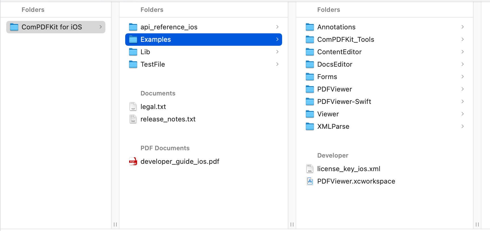
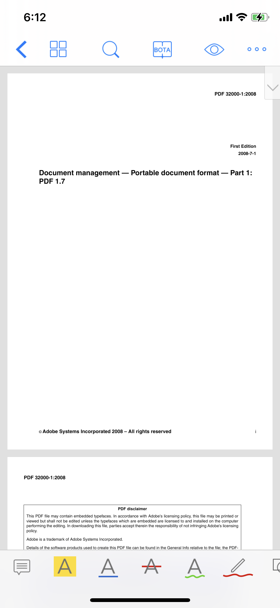
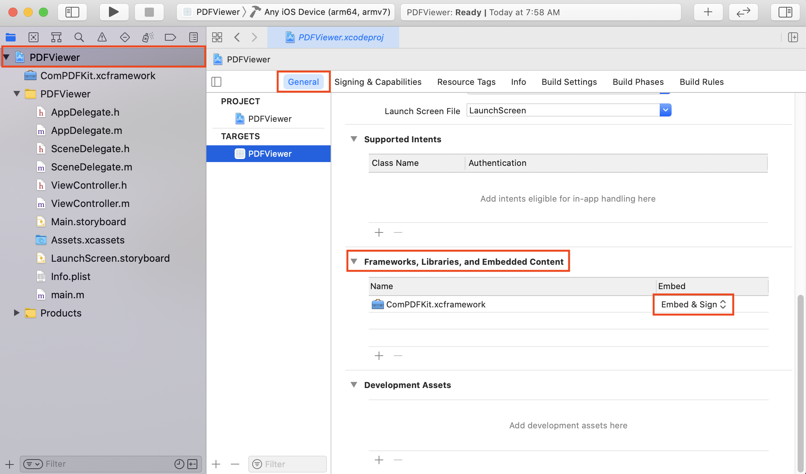
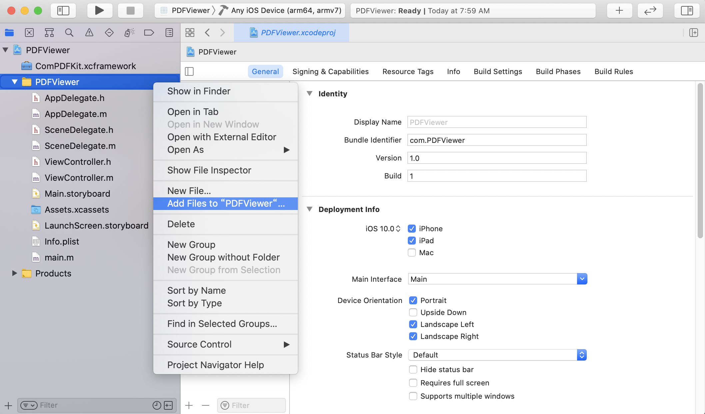
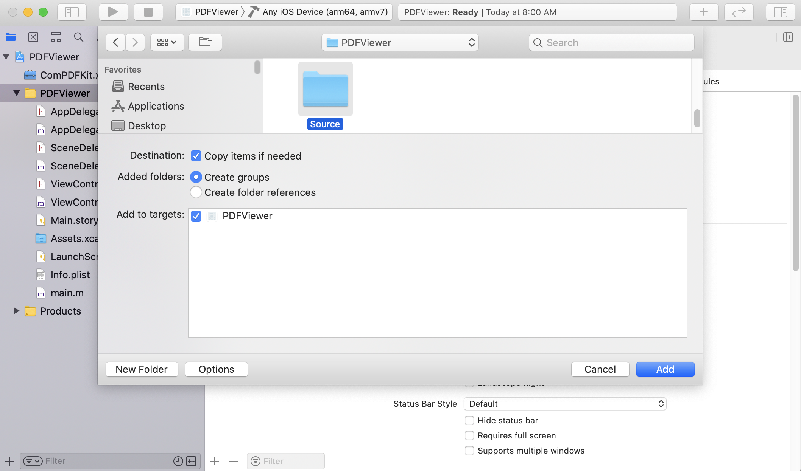
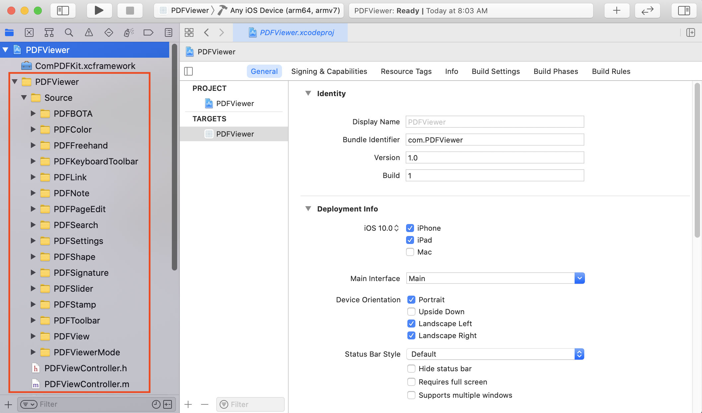

# 1 Overview

ComPDFKit, a software development kit (SDK), consists of PDF SDK and PDF Conversion SDK. With ComPDFKit, even developers with limited knowledge of PDF can quickly integrate professional PDF functions with just a few lines of code on multiple platforms. And we will introduce ComPDFKit PDF SDK for iOS here.

ComPDFKit PDF SDK for iOS is a robust PDF library for developers who need to develop applications on iOS, which offers powerful Objective-C APIs for quickly viewing, annotating, editing, and creating PDFs. It is feature-rich and battle-tested, making PDF files process and manipulation easier and faster for iOS devices.

## 1.1 ComPDFKit PDF SDK

ComPDFKit PDF SDK consists of two elements as shown in the following picture.


The two elements for ComPDFKit PDF SDK:

- **PDF Core API**

The Core API can be used independently for document rendering, analysis, text extraction, text search, form filling, password security, annotation creation and manipulation, and much more.

- **PDF View**

The PDF View is a utility class that provides the functionality for developers to interact with rendering PDF documents per their requirements. The View Control provides fast and high-quality rendering, zooming, scrolling, and page navigation features. The View Control is derived from platform-related viewer classes (e.g. `UIView` on iOS) and allows for extension to accommodate specific user needs.

## 1.2 Key Features

**Viewer** component offers:

- Standard page display modes, including Scrolling, Double page, Crop mode, and Cover mode.
- Navigation with thumbnails, outlines, and bookmarks.
- Text search & selection.
- Zoom in and out & Fit-page.
- Switch between different themes, including Dark mode, Sepia mode, Reseda mode, and Custom color mode.
- Text reflow.

**Annotations** component offers:

- Create, edit and remove annotations, including Note, Link, Freetext, Line, Square, Circle, Highlight, Underline, Squiggly, Strikeout, Stamp, Ink, Sound
- Support for annotation appearances.
- Import and export annotations to/from XFDF.
- Support for annotation flattening.
- Predefine annotations.

**Forms** component offers:

- Create, edit and remove form fields, including Push Button, Check Box, Radio Button, Text Field, Combo Box, List Box, and Signature.
- Fill PDF Forms.
- Support for PDF form flattening.

**Document editor** component offers:

- PDF manipulation, including Split pages, Extract pages, and Merge pages.
- Page edit, including Delete pages, Insert pages, Crop pages, Move pages, Rotate pages, Replace pages, and Exchange pages.
- Document information setting.
- Extract images.

**Security** component offers:

- Encrypt and decrypt PDFs, including Permission setting and Password protected.
- Create, edit, and remove watermark.
- Redact content including images, text, and vector graphics.
- Create, edit, and remove header & footer, including dates, page numbers, document name, author name, and chapter name.
- Create, edit, and remove bates numbers.
- Create, edit, and remove background that can be a solid color or an image.

**Conversion** component offers:

- PDF to PDF/A.

## 1.3 License

ComPDFKit PDF SDK is a commercial SDK, which requires a license to grant developer permission to release their apps. Each license is only valid for one bundle ID in development mode. Other flexible licensing options are also supported, please contact [our marketing team](mailto:support@compdf.com) to know more.  However, any documents, sample code, or source code distribution from the released package of ComPDFKit to any third party is prohibited.

# 2 Get Started

It is easy to embed ComPDFKit in your iOS app with a few lines of Objective-C code. Takes just a few minutes and gets started. 

The following sections introduce the structure of the installation package, how to run a demo, and how to make an iOS app in Objective-C with ComPDFKit PDF SDK. 

## 2.1 Requirements

ComPDFKit requires the latest stable version of Xcode available at the time the release was made. This is a hard requirement, as each version of Xcode is bundled with a specific version of the iOS Base SDK, which often defines how UIKit and various other frameworks behave. 

- iOS 10.0 or higher.
- Xcode 12.0 or newer for Objective-C or Swift.

## 2.2 iOS Package Structure

The package of ComPDFKit PDF SDK for iOS includes the following files as shown in Figure 2-1:

- **ComPDFKit.xcframework** - Include the ComPDFKit dynamic library (arm64_armv7, x86_64-simulator) and associated header files.
- **PDFViewer** - A folder containing iOS sample projects.
- **PDFViewer-Swift** - A folder containing Swift iOS sample projects.
- **api_reference_ios** - API reference.
- **developer_guide_ios.pdf** - Developer guide.
- **release_notes.txt** - Release information.
- **legal.txt** - Legal and copyright information.



<p align="center">
Figure 2-1
</p>

## 2.3 How to run a demo

ComPDFKit PDF SDK for iOS provides one demo in Objective-C for developers to learn how to call the SDK on iOS. You can find them in the ***"PDFViewer"*** folder. In this guide, it takes the "Objective-C" demo as an example to show how to run it in Xcode.

1. Double-click the ***"PDFViewer.xcodeproj"*** found in the ***"PDFViewer"*** folder to open the demo in Xcode.

2. Click on ***"Product -> Run"*** to run the demo on an iOS device. In this guide, an iPhone 7 Plus device will be used as an example. After building the demo successfully, on the start screen, click the ***"PDF32000_2008.pdf"*** document, and then it will be opened and displayed.

.<div align=center></div>

**Note:** *This is a demo project, presenting completed ComPDFKit PDF SDK functions. The functions might be different based on the license you have purchased. Please check that the functions you choose work fine in this demo project.*

## 2.4 How to Make an iOS App in Objective-C with ComPDFKit

This section will help you to quickly get started with ComPDFKit PDF SDK to make an iOS app in Objective-C with step-by-step instructions, which include the following steps:

1. Create a new iOS project in Objective-C.
2. Integrate ComPDFKit into your apps.
3. Apply the license key.
4. Display a PDF document.

### 2.4.1 Create a New iOS Project in Objective-C

In this guide, we use Xcode 12.4 to create a new iOS project.

Fire up Xcode, choose **File** -> **New** -> **Project...**, and then select **iOS** -> **Single View Application** as shown in Figure 2-2. Click **Next**.


<p align="center">
Figure 2-2
</p>

Choose the options for your new project as shown in Figure 2-3. Please make sure to choose Objective- C as the programming language. Then, click **Next**.


<p align="center">
Figure 2-3
</p>

Place the project to the location as desired. Then, click **Create**.

### 2.4.2 Integrate ComPDFKit into Your Apps

There are two ways to integrate ComPDFKit PDF SDK for iOS into your apps. You can choose what works best for you based on your requirements.

If you just want to use the default built-in Ul implementations to develop your apps for simplicity and convenience, you need to include the following files:

- **ComPDFKit.xcframework** - Include the ComPDFKit dynamic library (arm64_armv7, x86_64-simulator) and associated header files.
- **Source files** - Found in the ***" PDFViewer / Source "*** folder. They are the default built-in Ul.
- **Resource files** - Found in the ***" PDFViewer / Resources "*** folder. They are needed for the default built-in Ul implementations, such as images, strings, and other resources.

If you want to customize your (PDF-related) app’s Ul design, you need to include the following files:

- **ComPDFKit.xcframework** - Include the ComPDFKit PDF SDK dynamic library (arm64_armv7, x86_64-simulator) and associated header files.
- **Resource files** - Found in the ***" PDFViewer / Resources "*** folder. They are needed for the default built-in Ul implementations, such as images, strings, and other resources.

To add the dynamic xcframework ***"ComPDFKit.xcframework"*** into the ***"PDFViewer"*** project, please follows the steps below:

1.Right-click the ***"PDFViewer"*** project, select **Add Files to "PDFViewer"...** as shown in Figure 2-4.


<p align="center">
Figure 2-4
</p>

2. Find and choose ***"ComPDFKit.xcframework"*** in the download package, and then click **Add** as shown in Figure 2-5.

**Note:** *Make sure to check the **"Copy items if needed"** option.*


<p align="center">
Figure 2-5
</p>

Then, the ***"PDFViewer"*** project will look like the Figure 2-6.


<p align="center">
Figure 2-6
</p>

3. Add the dynamic xcframework ***"ComPDFKit.xcframework"*** to the Xcode’s **Embedded Binaries**. Left-click the project, find **Embedded Binaries** in the **General** tab, and choose ***"Embed & Sign"*** as shown in Figure 2-7.



<p align="center">
Figure 2-7
</p>

### 2.4.3 Apply the License Key

It is important that you set the license key before using any ComPDFKit PDF SDK classes.

```objective-c
#import <ComPDFKit/ComPDFKit.h>

- (BOOL)application:(UIApplication *)application didFinishLaunchingWithOptions:(NSDictionary *)launchOptions {
  // Set your license key here. ComPDFKit is commercial software.
  // Each ComPDFKit license is bound to a specific app bundle id.
  // com.compdfkit.pdfviewer
    
    [CPDFKit setLicenseKey:@"YOUR_LICENSE_KEY_GOES_HERE"
                    secret:@"YOUR_LICENSE_SECRET_GOES_HERE"];
    
    return YES;
}
```

### 2.4.4 Display a PDF Document

So far, we have added ***"ComPDFKit.xcframework"*** to the ***"PDFViewer"*** project, and finished the initialization of the ComPDFKit PDF SDK. Now, let’s start building a simple PDF viewer with just a few lines of code.

Then, add the following code to ViewController.m to display a PDF document. It’s really easy to present a PDF on screen. All you need is to create a `CPDFDocument` object and then show it with a `CPDFView` object.

```
#import <ComPDFKit/ComPDFKit.h>

- (void)viewDidLoad {
    [super viewDidLoad];
    
    // Get the path of a PDF
    NSString *pdfPath = @"...";
    
    // Initialize a CPDFDocument object with the path to the PDF file
    NSURL *url = [NSURL fileURLWithPath:pdfPath];
    CPDFDocument *document = [[[CPDFDocument alloc] initWithURL:url] autorelease];
    if (document.error && document.error.code != CPDFDocumentPasswordError) {
        return;
    }
    
    // Initialize a CPDFView object with the size of the entire screen
    CPDFView *pdfView = [[[CPDFView alloc] initWithFrame:self.view.bounds] autorelease];
    
    // Set the document to display
    pdfView.document = document;
    
    // Add the pdfView to the root view
    [self.view addSubview:pdfView];
}
```

## 2.5 How to Make an iOS App in Objective-C with Default UI

***"PDFViewer"*** for iOS sample projects comes with a default UI design, including the basic UI for the app and the feature modules UI, which are implemented using ComPDFKit PDF SDK and are shipped in the ***" PDFViewer / Source "*** folder. Also included is a `PDFViewController` view controller that contains ready-to-use UI module implementations.

### 2.5.1 Integrate Default UI into Your Apps

1. Right-click the ***"PDFViewer"*** folder, select **Add Files to "PDFViewer"...** as shown in Figure 2-8.



<p align="center">
Figure 2-8
</p>

2. Find and choose ***"PDFViewController.h"***, ***"PDFViewController.m"*** and ***"Source"*** folder in the download package, and then click **Add** as shown in Figure 2-9.

**Note:** *Make sure to check the **"Copy items if needed"** option.*



<p align="center">
Figure 2-9
</p>

Then, the ***"PDFViewer"*** project will look like the Figure 2-10.



<p align="center">
Figure 2-10
</p>

3. To protect user privacy, an iOS app linked on or after iOS 10.0, and that accesses the device’s privacy-sensitive data, you need to do the following configuration in the ***“Info.plist“***.

```objective-c
<key>NSCameraUsageDescription</key>
<string>Your consent is required before you could access the function.</string>

<key>NSMicrophoneUsageDescription</key>
<string>Your consent is required before you could access the function.</string>

<key>NSPhotoLibraryAddUsageDescription</key>
<string>Your consent is required before you could access the function.</string>

<key>NSPhotoLibraryUsageDescription</key>
<string>Your consent is required before you could access the function.</string>
```

### 2.5.2 How to Initialize the PDFViewController Class

To initialize `PDFViewController` Class, refer to the following method in the `PDFViewController` class.

```objective-c
PDFViewController *vc = [[[PDFViewController alloc] initWithFilePath:filePath] autorelease];
```

### 2.5.3 How to Handle PDF Document Loading

To handle PDF document loading, refer to the following method in the ***"PDFViewController.m"*** file.

```objective-c
- (void)loadDocumentWithFilePath:(NSString *)filePath completion:(void (^)(BOOL result))completion;
```

### 2.5.4 How to Use the PDFListView Class

`PDFListView` is a subclass of `CPDFView` that contains operations for annotations.

1. Add support for Annotations

   Set the `annotationMode` property to enter a different annotation mode, and click or drag to add a different annotation in the PDF view. Refer to the following method in the ***"PDFViewController.m"*** file.

   ```objective-c
   - (PDFToolbar *)annotationToolbar;
   ```

2. Implementing delegate method

   About Implementing delegate method, refer to the following method in the ***"PDFViewController.m"*** file.

   ```objective-c
   // Add and modify text annotation
   - (void)PDFViewPerformOpenNote:(PDFListView *)pdfView forAnnotation:(CPDFAnnotation *)annotation;
   
   // Modify annotation color
   - (void)PDFViewPerformChangeColor:(PDFListView *)pdfView forAnnotation:(CPDFAnnotation *)annotation;
   
   // Share markup annotation
   - (void)PDFViewPerformShare:(PDFListView *)pdfView forAnnotation:(CPDFMarkupAnnotation *)annotation;
   
   // Save stamp image
   - (void)PDFViewPerformSave:(PDFListView *)pdfView forAnnotation:(CPDFStampAnnotation *)annotation;
   
   // Add popup for markup annotation
   - (void)PDFViewPerformPopup:(PDFListView *)pdfView forAnnotation:(CPDFMarkupAnnotation *)annotation;
   
   // Add and modify link annotation
   - (void)PDFViewPerformEditLink:(PDFListView *)pdfView forAnnotation:(CPDFLinkAnnotation *)annotation;
   
   // Signature widget add signature
   - (void)PDFViewPerformSignatureWidget:(PDFListView *)pdfView forAnnotation:(CPDFSignatureWidgetAnnotation *)annotation;
   
   // Share selection text
   - (void)PDFViewPerformShare:(PDFListView *)pdfView forSelection:(CPDFSelection *)selection;
   
   - (void)PDFViewPerformDefine:(PDFListView *)pdfView forSelection:(CPDFSelection *)selection;
   
   // Search selection text for Google
   - (void)PDFViewPerformGoogleSearch:(PDFListView *)pdfView forSelection:(CPDFSelection *)selection;
   
   // Search selection text for Wiki
   - (void)PDFViewPerformWikiSearch:(PDFListView *)pdfView forSelection:(CPDFSelection *)selection;
   
   // Add Signture annotation
   - (void)PDFViewPerformAddSignture:(PDFListView *)pdfView atPoint:(CGPoint)point forPage:(CPDFPage *)page;
   
   // Add Stamp annotation
   - (void)PDFViewPerformAddStamp:(PDFListView *)pdfView atPoint:(CGPoint)point forPage:(CPDFPage *)page;
   
   // Add Image annotation
   - (void)PDFViewPerformAddImage:(PDFListView *)pdfView atPoint:(CGPoint)point forPage:(CPDFPage *)page;
   
   - (void)PDFViewPerformTouchEnded:(PDFListView *)pdfView;
   
   // Page jump
   - (void)PDFViewPerformWillGoTo:(PDFListView *)pdfView pageIndex:(NSInteger)pageIndex;
   ```
   
### 2.5.5 How to Use the PDFKeyboardToolbar Class

PDFKeyboardToolbar is the keyboard toolbar of the Freetext annotation input box.

1. Initialize the PDFKeyboardToolbar class

   Initialize the `PDFKeyboardToolbar` in the CPDFView delegate method, and refer to the following method in the ***"PDFViewController.m"*** file.

   ```objective-c
   - (void)PDFViewShouldBeginEditing:(CPDFView *)pdfView textView:(UITextView *)textView forAnnotation:(CPDFFreeTextAnnotation *)annotation {
       self.annotationFreeText = annotation;
       PDFKeyboardToolbar *keyboardToolbar = [[[PDFKeyboardToolbar alloc] initWithFontName:annotation.font.fontName fontSize:annotation.font.pointSize] autorelease];
       keyboardToolbar.delegate = self;
       [keyboardToolbar refreshFontName:annotation.font.fontName fontSize:annotation.font.pointSize opacity:annotation.opacity];
       [keyboardToolbar bindToTextView:textView];
   }
   ```

2. Implementing delegate method

   About Implementing delegate method, refer to the following method in the ***"PDFViewController.m"*** file.

   ```objective-c
   // keyboard should dissmiss
   - (void)keyboardShouldDissmiss:(PDFKeyboardToolbar *)toolbar;
   
   // Modify font name of freetext annotation
   - (void)keyboard:(PDFKeyboardToolbar *)toolbar updateFontName:(NSString *)fontName;
   
   // Modify font size of freetext annotation
   - (void)keyboard:(PDFKeyboardToolbar *)toolbar updateFontSize:(CGFloat)fontSize;
   
   // Modify text color of freetext annotation
   - (void)keyboard:(PDFKeyboardToolbar *)toolbar updateTextColor:(UIColor *)textColor;
   
   // Modify text opacity of freetext annotation
   - (void)keyboard:(PDFKeyboardToolbar *)toolbar updateOpacity:(CGFloat)opacity;


## 2.6 ARC Compatibility

ComPDFKit PDF SDK requires [non-ARC](https://www.codeography.com/2011/10/10/making-arc-and-non-arc-play-nice.html). If you wish to use ComPDFKit PDF SDK in a ARC project, just add the -fno-objc-arc compiler flag. To do this, go to the Build Phases tab in your target settings, open the Compile Sources group, and double-click and type [-fno-objc-arc](https://www.jianshu.com/p/b8cccbbd03f3) into the popover.


## 2.7 Swift Compatibility

To [use the ComPDFKit Objective-C Framework in your Swift project](http://rustemsoft.com/addSwiftHeader.htm), you have to create a Swift Bridging Header file in that project. The best way is to create the .h file Manually.

First, add a header file to your project with the name: MyProjectName-Bridging-Header.h. This will be the single header file where you import any Objective C code you need your Swift code to have access.

Find Swift Compiler - Code Generation section in your project build settings. Add the path to your bridging header file next to Objective C Bridging Header from the project root folder. It should be MyProject/MyProject-Bridging-Header.h

[How to use iOS Objective C Framework in Swift project?](https://stackoverflow.com/questions/24002369/how-to-call-objective-c-code-from-swift)


3 Support

## 3.1 Reporting Problems

Thank you for your interest in ComPDFKit PDF SDK, the only easy-to-use but powerful development solution to integrate high quality PDF rendering capabilities to your applications. If you encounter any technical questions or bug issues when using ComPDFKit PDF SDK for iOS, please submit the problem report to the ComPDFKit team. More information as follows would help us to solve your problem:

- ComPDFKit PDF SDK product and version.
- Your operating system and IDE version.
- Detailed descriptions of the problem.
- Any other related information, such as an error screenshot.

## 3.2 Contact Information

**Home Link:**

[https://www.compdf.com](https://www.compdf.com)

**Support & General Contact:**

Email: support@compdf.com


Thanks,
The ComPDFKit Team
