# ComPDF SDK for iOS (Objective-C PDF Library)

As part of the KDAN ecosystem, [ComPDF SDK for iOS](https://www.compdf.com/ios?utm_source=github&utm_medium=compdfkit-pdf-sdk-ios-objective-c&utm_campaign=compdfkit_pdf_sdk_ios_objective_c_repo&ref_platform_id=github_compdfkit) provides a robust Objective-C PDF library for developers who need to build viewing, annotation, editing, form, and signing workflows in iOS apps.

The ComPDF iOS PDF Library combines native Objective-C APIs with production-ready PDF components so teams can integrate document features faster.

> If you find ComPDF SDK useful, please consider giving us a ⭐ **Star** on GitHub — it helps us grow and improve! Got questions or ideas? Join the conversation in our [Discussions](https://github.com/ComPDFKit/compdfkit-pdf-sdk-ios-objective-c/discussions).

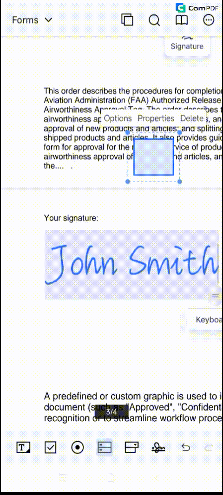

**Why ComPDF SDK for iOS?**

* **Easy to Integrate:** Integrate PDF functionalities easily with our powerful SDK and clear documentation and guides with few lines of code.
  
* **Fully Customizable UI:** Design a unique interface for your products with fully customizable UI source code by a high-performing SDK.
  
* **[Comprehensive PDF Features:](https://www.compdf.com/pdf-sdk/features-list?utm_source=github&utm_medium=compdfkit-pdf-sdk-ios-objective-c&utm_campaign=compdfkit_pdf_sdk_ios_objective_c_repo&ref_platform_id=github_compdfkit)** Supports generation, viewing, annotation, page editing, content editing, conversion, OCR, redaction, signing, forms, parsing, measurement, compression, comparison, color separation, batch processing, and more.
  
* **Faster Time-to-Market:** Comprehensive SDK libraries save your time and expenses and roll out your applications and projects.
  
* **High-quality Service:** We provide 24/7 professional one-to-one technical support, including onsite service and remote assistance via phone and email.
  

## Table of Contents

- [Supported Features](#supported-features)
- [Related](#related)
- [Preview](preview)
- [Requirements](#requirements)
- [Run the Demo](#run-the-demo)
- [How to Make an iOS App in Objective-C](#how-to-make-an-ios-app-in-objective-c)
- [Samples](#samples)
- [Free Trial and License](#free-trial-and-license)
- [Support](#support)
- [Changelog](#changelog)
- [Related](#related)


## Supported Features

**Viewer**: Fast and smooth PDF rendering and viewing

* Display Modes - single/double page, vertical & horizontal scrolling, cover mode, crop mode
* Text Search & Selection
* PDF Navigation - outlines, bookmarks

**Annotations**:

* Notes - add longer comments with adjustable icon shape and color

* Ink - freehand drawing with customizable color, opacity, line thickness

* Text - add, move, resize text directly on page

* Inspector - adjust annotation looks (line styles, borders, colors, opacity, font)

* Comment on Annotations and Update Status

* Import & Export & Flatten Annotations (XFDF, FDF, JSON)

* Highlight, Underline, Strikeout, Squiggly

* Shapes - Rectangle, Oval, Line, Arrow, Polygon, Polyline, Cloud

* Stamps, Sound, Movie, File Attachment, Link, Distance, Perimeter, Area

**Forms**:

* Process fillable and static PDF forms

* Form filling, form creation, form flattening

**Document Editor**:

* Page manipulation - insert, delete, rotate, reorder, extract, crop

* Split PDF, Merge PDF

**Content Editor**: Edit PDF text and images directly like in Word

**Security**:

* Encryption - set open password, permission password

* Restrict printing, copying, editing

**Signatures**:

* Electronic Signatures - draw, type, image signatures

* Digital Signatures - certificate-based signature validation

**Watermark:**

* Add Text or Image Watermarks

* Delete Watermarks

* Customize Watermarks

**OCR:**

* AI OCR

* Recognize Tables, Graphics, Images

* Support recognition in 80+ Languages

**Compare Documents**: Side-by-side document comparison to highlight differences

**Redaction**: Permanently remove sensitive content from PDFs

**Measurement**: Distance, area, perimeter measurement tools

**Compress**: Optimize and reduce PDF file size

**Convert Files**:

* Convert PDF to Word, Excel, PPT, HTML, CSV, images (PNG,JPEG, JPEG, JPEG2000, BMP, TIFF, TGA, GIF), RTF, TXT, JSON, XML, markdown, searchable PDF, searchable OFD.

* Convert images (PNG,JPEG, JPEG, JPEG2000, BMP, TIFF, TGA, GIF) to Word, Excel, PPT, HTML, CSV, RTF, TXT, JSON, XML.

* Convert Word, Excel, PPT, HTML, CSV, PNG, RTF, TXT to PDF

**UI Customization**:

* Toolbar Customization

* UI Personalization

* Ready-Made UI Options

* Out-of-the-box Source Code

## Preview

ComPDF SDK for iOS delivers a smooth, feature-rich PDF experience on ios devices.

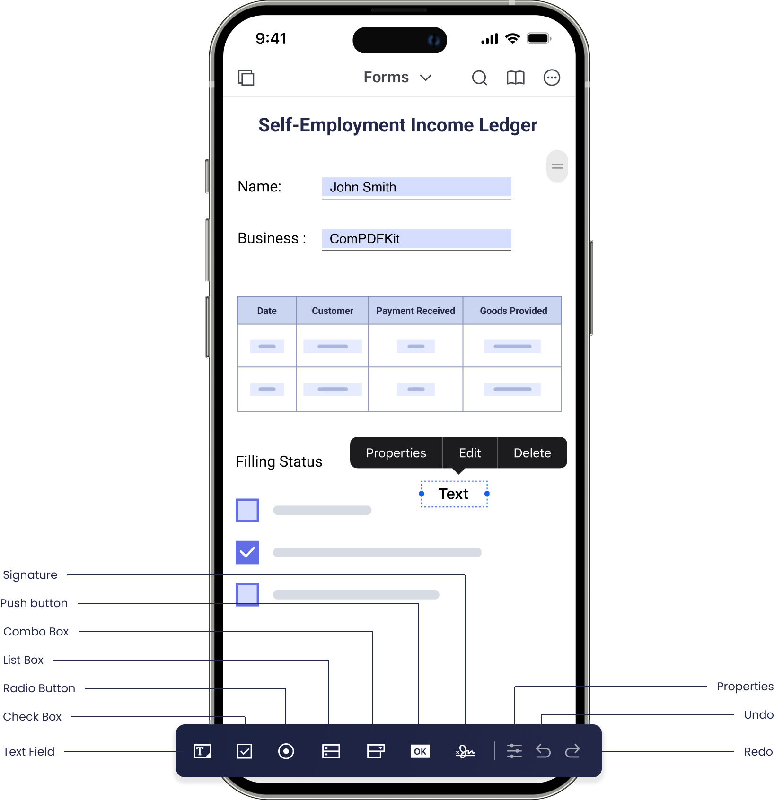


## Requirements

[ComPDF SDK for iOS](https://www.compdf.com/guides/pdf-sdk/ios/overview?utm_source=github&utm_medium=compdfkit-pdf-sdk-ios-objective-c&utm_campaign=compdfkit_pdf_sdk_ios_objective_c_repo&ref_platform_id=github_compdfkit) requires the latest stable version of Xcode available at the time the release was made. This is a hard requirement, as each version of Xcode is bundled with a specific version of the iOS Base SDK, which often defines how UIKit and various other frameworks behave.

- iOS 10.0 or higher.
- Xcode 13.0 or newer for Objective-C or Swift.


## Run the Demo

ComPDF SDK for iOS provides multiple demos in Objective-C for developers to learn how to call the SDK on iOS. You can find them in the ***"Examples/Objective-C"*** folder.

In this guide, we take ***"PDFViewer"*** as an example to show how to run it in Xcode (The demo in Objective-C uses the ***"xcodeproj"*** method, so you can directly open ***"PDFViewer.xcodeproj"***).

1. Copy the applied ***"license_key_ios.xml"*** file to ***"Examples"*** folder to replace (There is already a method to parse the xml file in demo, please do not modify the storage location and file name).

2. Find ***"PDFViewer.xcodeproj"*** in the ***"Examples/Objective-C"*** folder and double-click to open it, find the schemes of ***"PDFViewer"*** in Xcode, and select the corresponding simulator (ComPDF does not support the simulator to run M1 chip, but we have made it compatible in `Excluded Architectures`, you can see the processing method in **Troubleshooting**.
   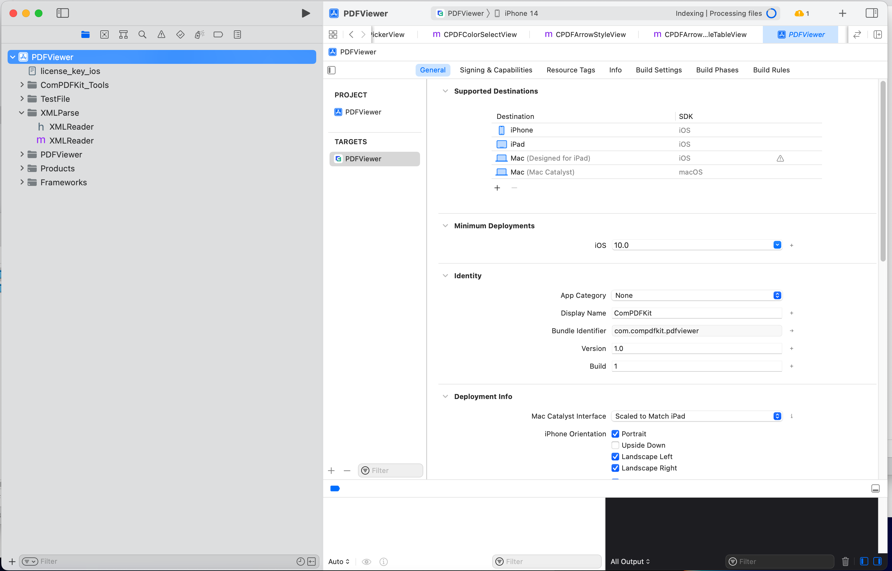

3. Click **Product -> Run** to run the demo on an iOS device. In this guide, we use an iPhone 14 device as an example. After building the demo successfully, the ***"PDF32000_2008.pdf"*** file will be opened and displayed.
   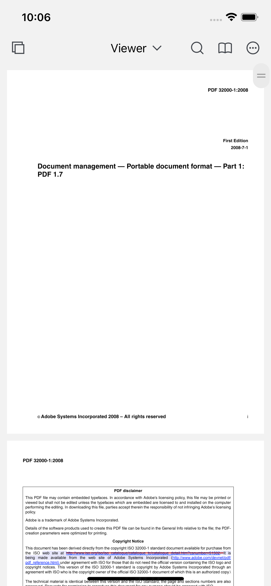

**Note:** *This is a demo project, presenting completed [ComPDF SDK](https://www.compdf.com/pdf-sdk?utm_source=github&utm_medium=compdfkit-pdf-sdk-ios-objective-c&utm_campaign=compdfkit_pdf_sdk_ios_objective_c_repo&ref_platform_id=github_compdfkit) functions. The functions might be different based on the license you have purchased. Please check that the functions you choose work fine in this demo project.*


## How to Make an iOS App in Objective-C

This section will help you to quickly get started with ComPDF SDK to make an iOS app in Objective-C with step-by-step instructions, which include the following steps:

- Create a new iOS project in Objective-C.
- Integrate ComPDF into your apps.
- Apply the license key.
- Display a PDF document.

### Create a New Project

In this guide, we use Xcode 12.4 to create a new iOS project.

1. Fire up Xcode, choose **File** -> **New** -> **Project...**, and then select **iOS** -> **Single View Application**. Click **Next**.

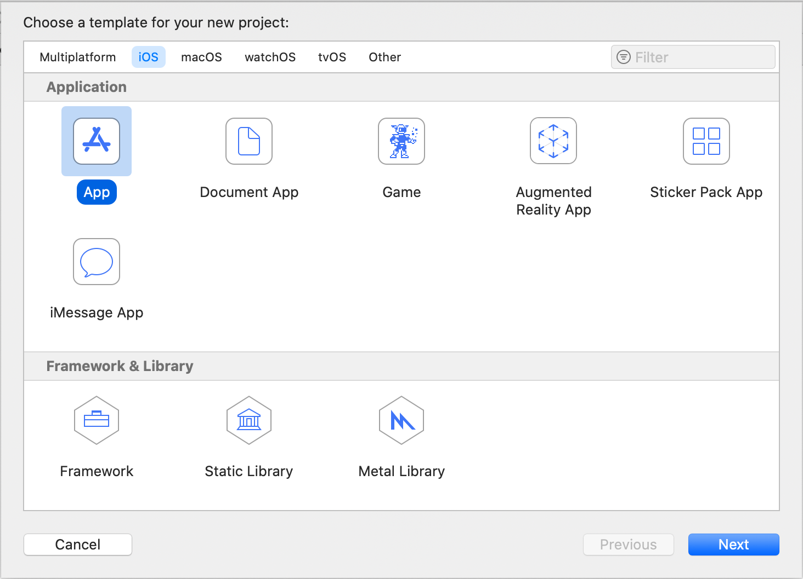

2. Choose the options for your new project. Please make sure to choose Objective-C as the programming language. Then, click **Next**.

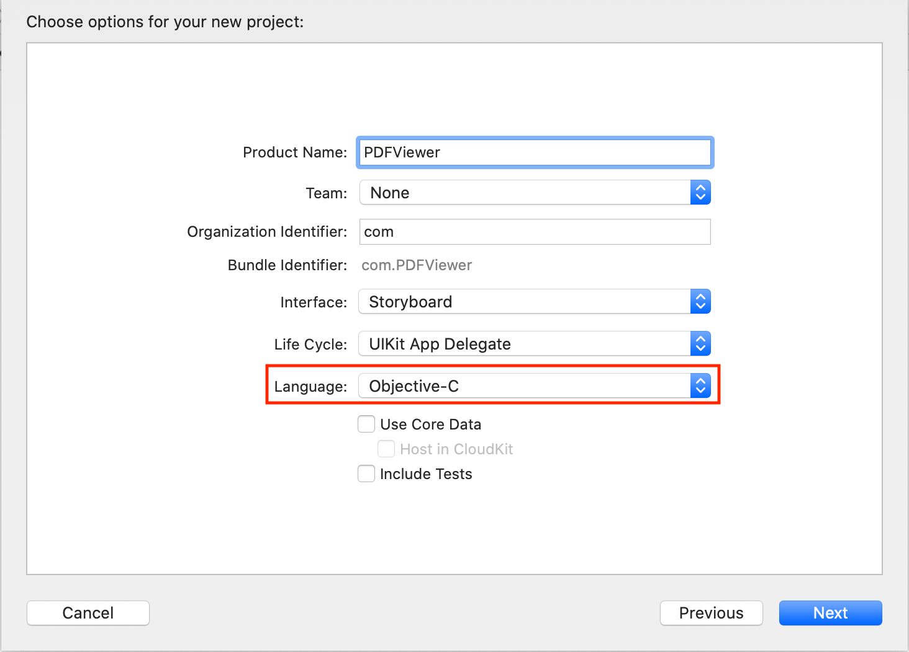

3. Place the project to the location as desired. Then, click **Create**.

### Integrate ComPDF into Your Apps

To add the dynamic xcframework ***"ComPDF.xcframework"*** into the ***"PDFViewer"*** project, please follow the steps below:

1. Right-click the ***"PDFViewer"*** project, select **Add Files to "PDFViewer"...**.
   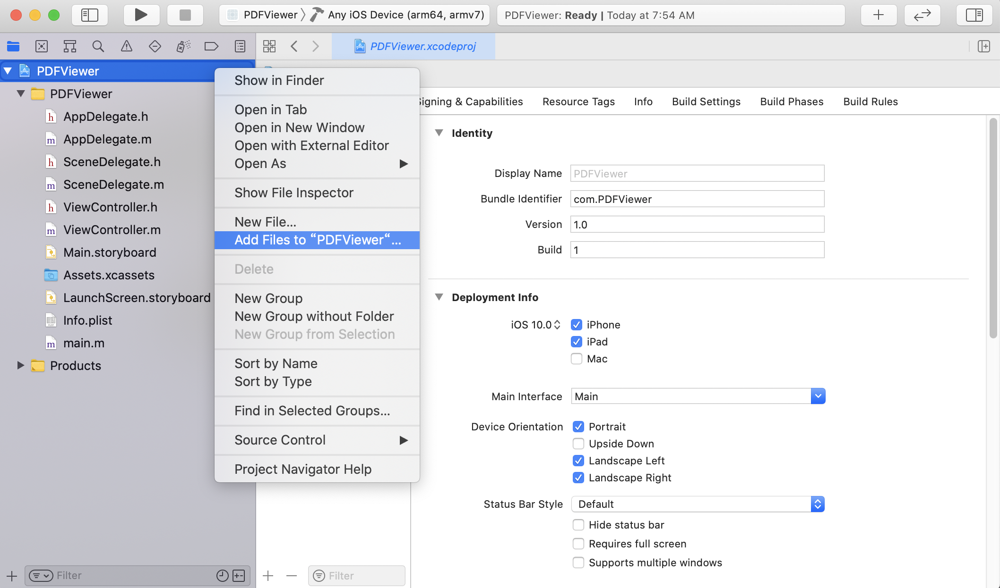

2. Find and choose ***"ComPDF.xcframework"*** in the download package, and then click **Add**.
   **Note:** *Make sure to check the **Copy items if needed** option.*
   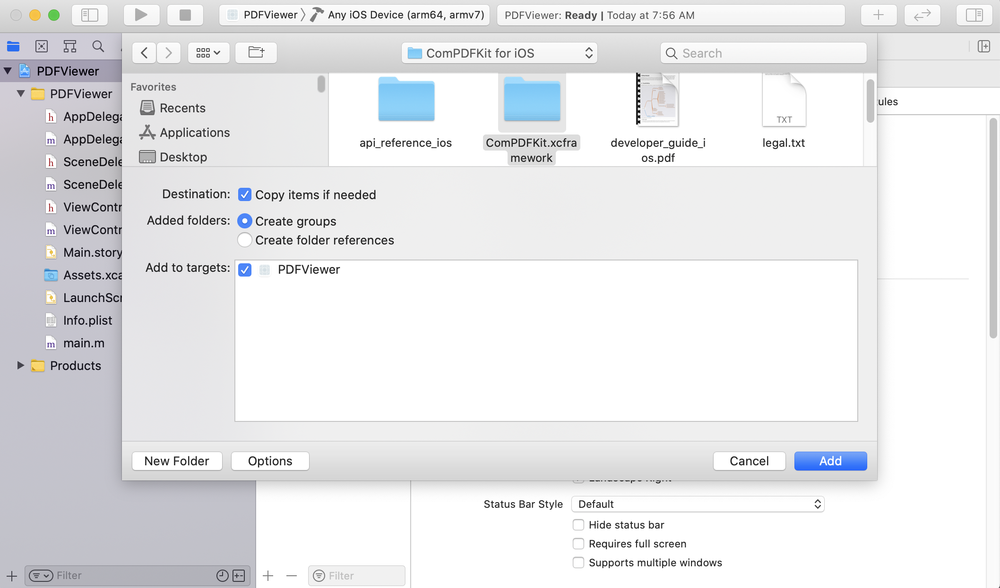

3. Then, the ***"PDFViewer"*** project will look like the following picture.
   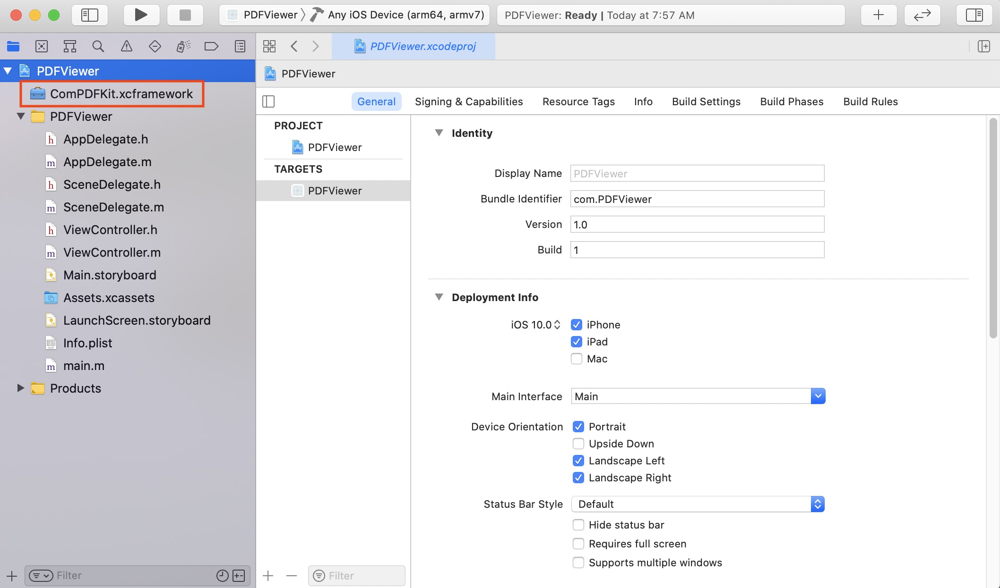

4. Add the dynamic xcframework ***"ComPDF.xcframework"*** to the Xcode's **Embedded Binaries**. Left-click the project, find **Embedded Binaries** in the **General** tab, and choose **Embed & Sign**.
   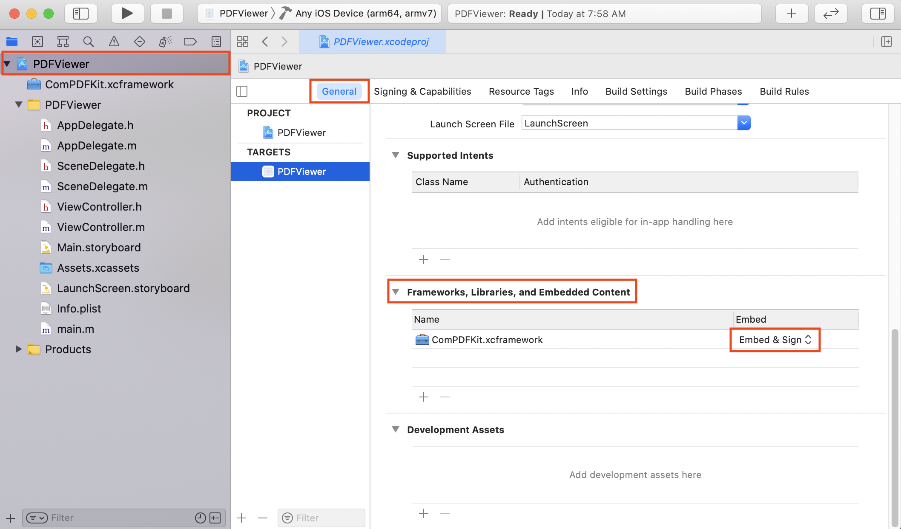

5. For earlier versions of Xcode (like Xcode 13), the Bitcode option might be turned on by default, which requires it to be turned off to run. The precise steps to do this are illustrated as shown in the picture below. 
   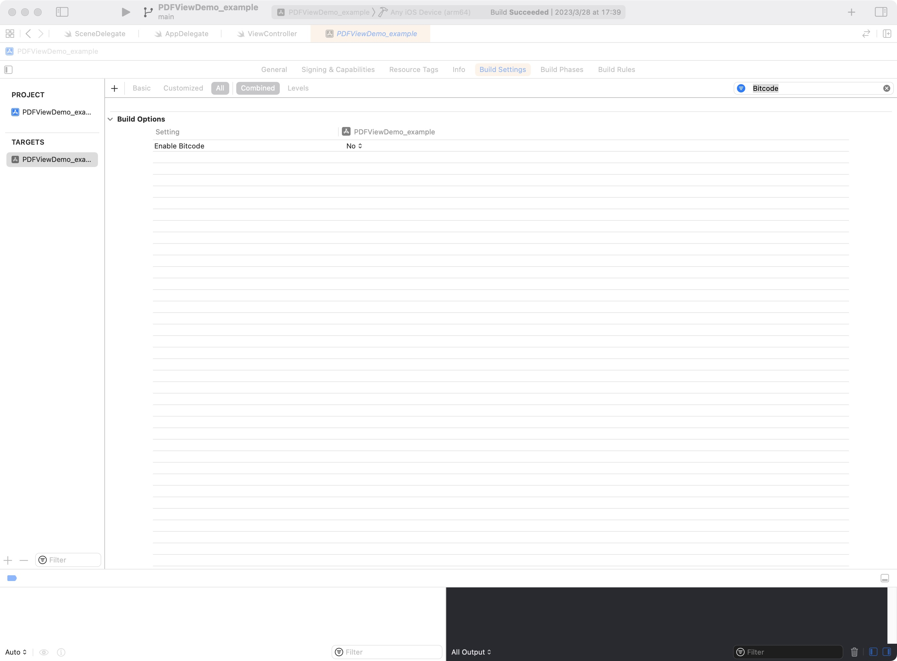

### Apply the License Key

Contact [ComPDF's sales team](https://www.compdf.com/contact-sales?utm_source=github&utm_medium=compdfkit-pdf-sdk-ios-objective-c&utm_campaign=compdfkit_pdf_sdk_ios_objective_c_repo&ref_platform_id=github_compdfkit) to get a license for free to test this project.

1. Import the header file ***"ComPDF/ComPDF.h"*** to `AppDelegate.m`.

2. Follow the code below and call the method `CPDFKit verifyWithKey:@"LICENSE_KEY"` in `- (BOOL)application:(UIApplication *)application didFinishLaunchingWithOptions:(NSDictionary *)launchOptions`. You need to replace the  **LICENSE_KEY** with the license you obtained.
   
   ```objective-c
   #import <ComPDFKit/ComPDFKit.h>
   
   - (BOOL)application:(UIApplication *)application didFinishLaunchingWithOptions:(NSDictionary *)launchOptions {
     // Set your license key here. ComPDFKit is commercial software.
     // Each ComPDFKit license is bound to a specific app bundle id.
     // com.compdfkit.pdfviewer
   
       [CPDFKit verifyWithKey:@"YOUR_LICENSE_KEY_GOES_HERE"];
   
       return YES;
   }
   ```

3. Compile and run the project. If the console outputs "version information", it means that the license has been set successfully. Otherwise, please check "[Troubleshooting](#2.4.5 Troubleshooting)" or check error logs in the console to quickly identify and solve the issue. 

### Display a PDF Document

So far, we have added ***"ComPDF.xcframework"*** to the ***"PDFViewer"*** project and finished the initialization of the ComPDF SDK. Now, let’s start building a simple PDF viewer with just a few lines of code.

1. Prepare a test PDF file, and drag and drop it into the newly created **PDFView** project. In this way, you can load and preview the local PDF document using `NSBundle`. The following image shows an example of importing a PDF document named “Online5” into the project.
   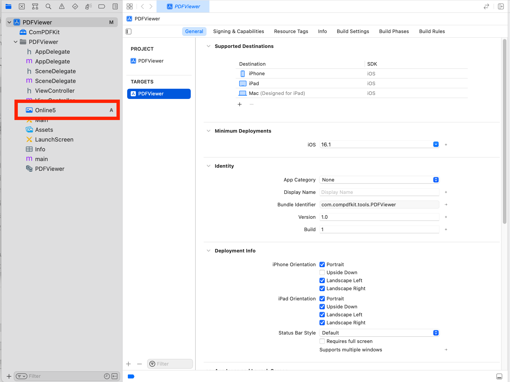

2. Import `<ComPDFKit/ComPDFKit.h>`  at the top of your `UIViewController.m` subclass implementation:
   
   ```objective-c
   #import <ComPDFKit/ComPDFKit.h>
   ```

3. Create a `CPDFDocument` object through **NSURL**, and create a `CPDFView` to display it. The following code shows how to load PDF data using a local PDF path and display it by `CPDFView`.
   
   ```objective-c
   NSBundle *bundle  = [NSBundle mainBundle];
   NSString *pdfPath= [bundle pathForResource:@"Online5" ofType:@"pdf"];
   NSURL *url = [NSURL fileURLWithPath:pdfPath];
   CPDFDocument *document = [[CPDFDocument alloc] initWithURL:url];
   
   CGRect rect = self.view.bounds;
   CPDFView *pdfView = [[CPDFView alloc] initWithFrame:rect];
   pdfView.autoresizingMask = UIViewAutoresizingFlexibleWidth | UIViewAutoresizingFlexibleHeight;
   pdfView.document = document;
   ```

4. Add the created `CPDFView` to the view of the current controller. The sample code is shown below.
   
   ```objective-c
    [self.view addSubview:pdfView];
   ```

5. The code shown here is a collection of the steps mentioned above:
   
   ```objective-c
   - (void)viewWillAppear:(BOOL)animated {
       [super viewWillAppear:animated];
   
       NSBundle *bundle  = [NSBundle mainBundle];
       NSString *pdfPath= [bundle pathForResource:@"Online5" ofType:@"pdf"];
       NSURL *url = [NSURL fileURLWithPath:pdfPath];
       CPDFDocument *document = [[CPDFDocument alloc] initWithURL:url];
   
       CGRect rect = self.view.bounds;
       CPDFView *pdfView = [[CPDFView alloc] initWithFrame:rect];
       pdfView.autoresizingMask = UIViewAutoresizingFlexibleWidth | UIViewAutoresizingFlexibleHeight;
       pdfView.document = document;
       [self.view addSubview:pdfView];
   }
   ```

6. Connect your device or simulator, and use the shortcut **Command_R** to run the App. The PDF file will be opened and displayed.
   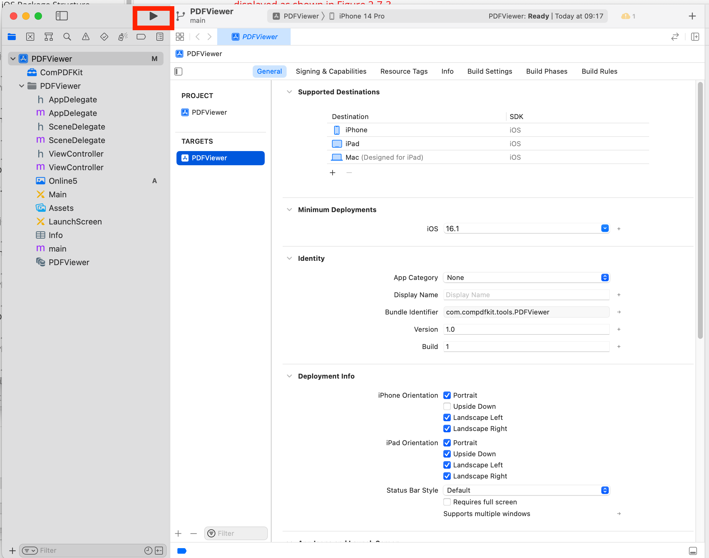

### Troubleshooting

1. Bitcode
   Even when all configurations are correct, there may still be compilation errors. First, check if the Bitcode is disabled. In earlier versions of Xcode (such as Xcode 13), the Bitcode option may be enabled by default. It needs to be set to **No** in order to run the app.

2. License
   If a License setting error occurs, ensure that the Identity (Bundle ID) setting in **General** matches the Bundle ID you provided when contacting us for the license. If an expired License message appears, please contact the [ComPDF team](https://www.compdf.com/contact-us?utm_source=github&utm_medium=compdfkit-pdf-sdk-ios-objective-c&utm_campaign=compdfkit_pdf_sdk_ios_objective_c_repo&ref_platform_id=github_compdfkit) to obtain the latest License and Key.

3. Cannot Run on i386 Architecture Simulator
   The version of Xcode 12.5 or newer, doesn't support i386 simulators. Apple dropped the i386 after switching to ARM processors and no longer maintains i386 architecture simulators. Please use ARM simulators or x86_64 architecture simulators to test and develop your program.
   So you need to search for **Excluded Architectures** in **Build Settings** in **TARGETS**, and then double-click it. A pop-up window will be popped up, click the plus sign (as shown below) to add **i386**.
   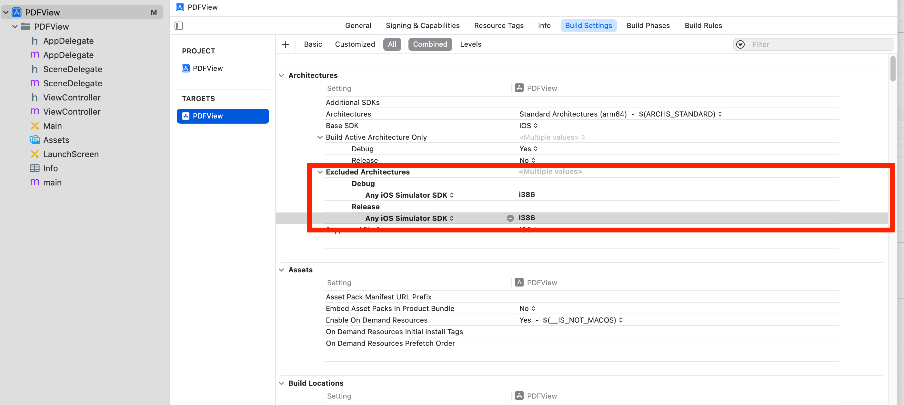

4. No PDF Displayed
   Check if the special encoding is required in the path we passed in, or if the local path we passed in exists.

5. Other Problems
   If you meet some other problems when integrating our ComPDF SDK for iOS, feel free to contact [ComPDF's support team](https://www.compdf.com/support?utm_source=github&utm_medium=compdfkit-pdf-sdk-ios-objective-c&utm_campaign=compdfkit_pdf_sdk_ios_objective_c_repo&ref_platform_id=github_compdfkit).


## Samples

There are many samples in the **Samples** folder that demonstrate the main features of the [ComPDF API](https://api.compdf.com/?utm_source=github&utm_medium=compdfkit-pdf-sdk-ios-objective-c&utm_campaign=compdfkit_pdf_sdk_ios_objective_c_repo&ref_platform_id=github_compdfkit) and how to use them, such as adding watermarks, comments, forms, etc. to PDFs. You can copy the code, add it to your project and run it directly. Or, you can get our [code examples for iOS](https://www.compdf.com/guides/pdf-sdk/ios/examples?utm_source=github&utm_medium=compdfkit-pdf-sdk-ios-objective-c&utm_campaign=compdfkit_pdf_sdk_ios_objective_c_repo&ref_platform_id=github_compdfkit). To learn more about the ComPDF API, please visit our [API Reference](https://developers.compdf.com/guides/pdf-sdk/ios/api-reference/index?utm_source=github&utm_medium=compdfkit-pdf-sdk-ios-objective-c&utm_campaign=compdfkit_pdf_sdk_ios_objective_c_repo&ref_platform_id=github_compdfkit).

## Free Trial and License

[ComPDF SDK for iOS](https://www.compdf.com/?utm_source=github&utm_medium=compdfkit-pdf-sdk-ios-objective-c&utm_campaign=compdfkit_pdf_sdk_ios_objective_c_repo&ref_platform_id=github_compdfkit) offers a **30-day free trial** so you can evaluate core PDF capabilities in your own application.

To get started:

1. Apply for a [free trial](https://www.compdf.com/pricing?utm_source=github&utm_medium=compdfkit-pdf-sdk-ios-objective-c&utm_campaign=compdfkit_pdf_sdk_ios_objective_c_repo&ref_platform_id=github_compdfkit)
2. Review supported trial features and licensing details
3. Follow the integration and license steps above to activate the SDK in your project

For custom deployments, advanced features, or volume licensing, please [contact our sales team](https://www.compdf.com/contact-sales?utm_source=github&utm_medium=compdfkit-pdf-sdk-ios-objective-c&utm_campaign=compdfkit_pdf_sdk_ios_objective_c_repo&ref_platform_id=github_compdfkit)

## Support

[ComPDF](https://www.compdf.com/?utm_source=github&utm_medium=compdfkit-pdf-sdk-ios-objective-c&utm_campaign=compdfkit_pdf_sdk_ios_objective_c_repo&ref_platform_id=github_compdfkit) has a professional R&D team that produces comprehensive technical documentation and guides to help developers. Also, you can get an immediate response when reporting your problems to our support team.

* For detailed information, please visit our [Guides](https://www.compdf.com/guides/pdf-sdk/ios/overview?utm_source=github&utm_medium=compdfkit-pdf-sdk-ios-objective-c&utm_campaign=compdfkit_pdf_sdk_ios_objective_c_repo&ref_platform_id=github_compdfkit) page.
* For technical assistance, please reach out to our [Technical Support](https://www.compdf.com/support?utm_source=github&utm_medium=compdfkit-pdf-sdk-ios-objective-c&utm_campaign=compdfkit_pdf_sdk_ios_objective_c_repo&ref_platform_id=github_compdfkit).
* To get more details and an accurate quote, please contact our [Sales Team](https://www.compdf.com/contact-sales?utm_source=github&utm_medium=compdfkit-pdf-sdk-ios-objective-c&utm_campaign=compdfkit_pdf_sdk_ios_objective_c_repo&ref_platform_id=github_compdfkit) or [send an email](mailto:support@compdf.com).


## Changelog

Keep up with the latest updates, improvements, and bug fixes for ComPDF SDK for iOS: [View iOS Changelog](https://www.compdf.com/pdf-sdk/changelog-ios?utm_source=github&utm_medium=compdfkit-pdf-sdk-ios-objective-c&utm_campaign=compdfkit_pdf_sdk_ios_objective_c_repo&ref_platform_id=github_compdfkit).

## Related

* More Guides:
  
  - [ComPDF SDK for iOS Documentation Guide](https://www.compdf.com/guides/pdf-sdk/ios/overview?utm_source=github&utm_medium=compdfkit-pdf-sdk-ios-objective-c&utm_campaign=compdfkit_pdf_sdk_ios_objective_c_repo&ref_platform_id=github_compdfkit)
  
  - [How to Build an iOS PDF Viewer or Editor in Objective-C](https://www.compdf.com/blog/build-an-ios-pdf-viewer-or-editor-in-objective-c?utm_source=github&utm_medium=compdfkit-pdf-sdk-ios-objective-c&utm_campaign=compdfkit_pdf_sdk_ios_objective_c_repo&ref_platform_id=github_compdfkit)
  
  - [Code Samples for iOS](https://www.compdf.com/guides/pdf-sdk/ios/examples?utm_source=github&utm_medium=compdfkit-pdf-sdk-ios-objective-c&utm_campaign=compdfkit_pdf_sdk_ios_objective_c_repo&ref_platform_id=github_compdfkit)
  
  - [ComPDF API Reference](https://api.compdf.com/api-reference/overview?utm_source=github&utm_medium=compdfkit-pdf-sdk-ios-objective-c&utm_campaign=compdfkit_pdf_sdk_ios_objective_c_repo&ref_platform_id=github_compdfkit)
- More Platforms and Frameworks: [ComPDF SDK](https://www.compdf.com/?utm_source=github&utm_medium=compdfkit-pdf-sdk-ios-objective-c&utm_campaign=compdfkit_pdf_sdk_ios_objective_c_repo&ref_platform_id=github_compdfkit) seamlessly operates on [Web](https://www.compdf.com/web?utm_source=github&utm_medium=compdfkit-pdf-sdk-ios-objective-c&utm_campaign=compdfkit_pdf_sdk_ios_objective_c_repo&ref_platform_id=github_compdfkit), [Windows](https://www.compdf.com/windows?utm_source=github&utm_medium=compdfkit-pdf-sdk-ios-objective-c&utm_campaign=compdfkit_pdf_sdk_ios_objective_c_repo&ref_platform_id=github_compdfkit), [Android](https://www.compdf.com/android?utm_source=github&utm_medium=compdfkit-pdf-sdk-ios-objective-c&utm_campaign=compdfkit_pdf_sdk_ios_objective_c_repo&ref_platform_id=github_compdfkit), [iOS](https://www.compdf.com/ios?utm_source=github&utm_medium=compdfkit-pdf-sdk-ios-objective-c&utm_campaign=compdfkit_pdf_sdk_ios_objective_c_repo&ref_platform_id=github_compdfkit), [Mac](https://www.compdf.com/contact-sales?utm_source=github&utm_medium=compdfkit-pdf-sdk-ios-objective-c&utm_campaign=compdfkit_pdf_sdk_ios_objective_c_repo&ref_platform_id=github_compdfkit), and [Server](https://www.compdf.com/server?utm_source=github&utm_medium=compdfkit-pdf-sdk-ios-objective-c&utm_campaign=compdfkit_pdf_sdk_ios_objective_c_repo&ref_platform_id=github_compdfkit), with support for cross-platform frameworks such as [React Native](https://www.compdf.com/react-native?utm_source=github&utm_medium=compdfkit-pdf-sdk-ios-objective-c&utm_campaign=compdfkit_pdf_sdk_ios_objective_c_repo&ref_platform_id=github_compdfkit), [Flutter](https://www.compdf.com/flutter?utm_source=github&utm_medium=compdfkit-pdf-sdk-ios-objective-c&utm_campaign=compdfkit_pdf_sdk_ios_objective_c_repo&ref_platform_id=github_compdfkit), etc.

- ComPDF Cloud: We also provide Open API for developers. You can [register a free API account](https://api.compdf.com/signup?utm_source=github&utm_medium=compdfkit-pdf-sdk-ios-objective-c&utm_campaign=compdfkit_pdf_sdk_ios_objective_c_repo&ref_platform_id=github_compdfkit) to get up to 200+ API calls monthly for free.
